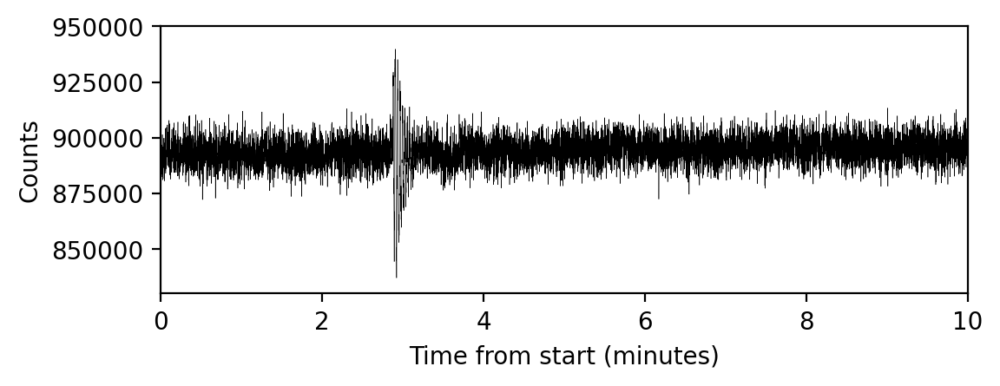

# Spelunker — NIRISS FGS quicklook pipeline 


-------------------------------------------------------------------------------------

**Authors:** Derod Deal (dealderod@ufl.edu), Néstor Espinoza (nespinoza@stsci.edu)

`spelunker` is a package that assists on studying JWST FGS/NIRISS guidestar data. Check out our [readthedocs](https://jwst-fgs-spelunker.readthedocs.io) for detailed documentation.

<a href="https://joss.theoj.org/papers/1547289b35b16a5d2955b20ed3945a2e"></a>

## Statement of need

Every time JWST observes an object, it simultaneously observes a nearby star --- a so-called "guide star" --- with the NIRISS Fine Guidance Sensor (FGS) that is used to keep the telescope locked on the target of interest. While researchers typically focus on their science targets, the guide star data can be extremely interesting on its own right both to detect anomalies on science data, as well as to explore time-series data of guidestars themselves. `spelunker` provides an easy-to-access ("plug-and-play") library to access this guide star data. The library is able to generate time-series for several metrics of the FGS data in an automated fashion, including fluxes and PSF variations, along with derived products from those such as periodograms that can aid on their analysis given only a JWST program ID number.

## Installation

To install `spelunker`, use `pip install`.

```bash
pip install spelunker
```

## Using the library

Get started with `spelunker` with only two lines of code.

```python
import spelunker

spk = spelunker.load(pid=1534)
```
This will download guidestar data for Program ID 1534; the `spk` object itself can then be used to explore this guidestar data! For example, let's make a plot of the guidestar time-series for the first minutes of this PID:

```python
import matplotlib.pyplot as plt

# Convert times from MJD to minutes:
fig, ax = plt.subplots(figsize=(6,2), dpi=200)

plt.plot( ( spk.fg_time - spk.fg_time[0] ) * 24 * 60, spk.fg_flux, color='black', linewidth=0.2 )

plt.xlim(0,10)
plt.ylim(830000,950000)
plt.xlabel('Time from start (minutes)')
plt.ylabel('Counts')

```
<p align='center'>
    
</p>

(See below on more information that can be extracted, including fitting 2D gaussians to each FGS integration!). 

We can even make a plot of the tracked guidestars within this Program ID. Within a selected Program ID, multiple guidestars could be used for each observation. Each star or object comes from the Guide Star Catalog (GSC) and is pre-selected depending on [telescope pointing and suitability of the star](https://jwst-docs.stsci.edu/jwst-observatory-characteristics/jwst-guide-stars). In the generated figure from `spk.guidestar_plot`, the guidestar positions (marked with an X) in the given Program ID are plotted from the *START* to the end of the program. A line (`gs track`) is traced between each guidestar to order each used target overtime.

```python
spk.guidestar_plot()
```
<p align='center'>
    
</p>


Mnemonics from JWST technical events can be overplotted on any timeseries, such as high-gain antenna (HGA) movement or to identify if the FGS tracks a new guidestar [if the `jwstuser` package is also installed](https://github.com/spacetelescope/jwstuser/). Here, use `spk.mnemonics` to access engineering telemetry for `SA_ZHAGUPST` as a matplotlib `axes` object:

```python
import matplotlib.pyplot as plt

spk.mast_api_token = 'insert a token from auth.MAST here'

fig, ax = plt.subplots(figsize=(12,4),dpi=200)

ax = spk.mnemonics_local('GUIDESTAR') # plots when the JWST tracks onto a new guidestars as a vertical line
ax = spk.mnemonics('SA_ZHGAUPST', 60067.84, 60067.9) # plots the start and end of high gain antenna movement

ax.plot(spk.fg_time, spk.fg_flux)
plt.legend(loc=3)
plt.xlim(60067.84, 60067.9)
plt.show()
```


For more information on the tools under `spelunker` and how to get started, visit the [quickstart guide](https://github.com/GalagaBits/JWST-FGS-Spelunker/blob/main/notebooks/fgs-spelunker_quickstart.ipynb) or checkout our [readthedocs](https://jwst-fgs-spelunker.readthedocs.io). Get acquainted with `spelunker` with the following example notebooks:

- [Pixel centroid changes and mnemonics](https://github.com/GalagaBits/JWST-FGS-Spelunker/blob/main/notebooks/examples/pixel_centroid_mnemonics.ipynb)
- [TSOS Guidestar Demo](https://github.com/GalagaBits/JWST-FGS-Spelunker/blob/main/notebooks/fgs-spelunker-and-tsos.ipynb)

This software is currently under development on [GitHub](https://github.com). To report bugs or to send feature requests, send us an email or [open an issue](https://github.com/GalagaBits/JWST-FGS-Spelunker/issues) on GitHub.

## Licence and attribution

This project is under the MIT License, which can be viewed [here](https://github.com/GalagaBits/JWST-FGS-Spelunker/blob/main/LICENSE).

## Acknowledgments

DD and NE would like to thank the STScI's Space Astronomy Summer Program (SASP) as well as the National Astronomy Consortium (NAC) program which made it possible for them to work together on this fantastic project!