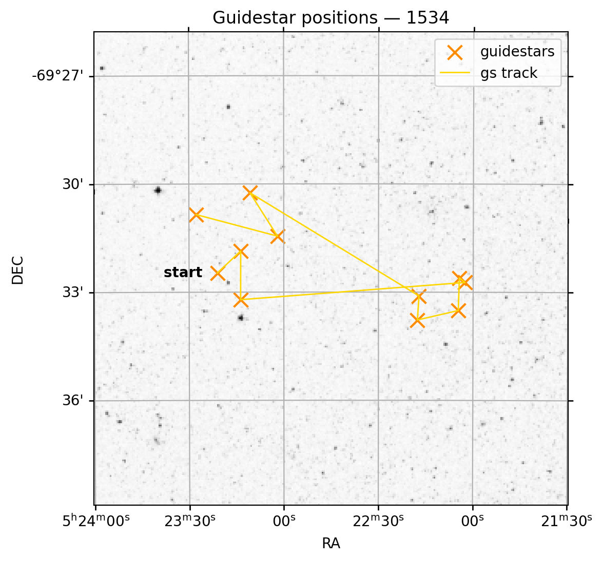
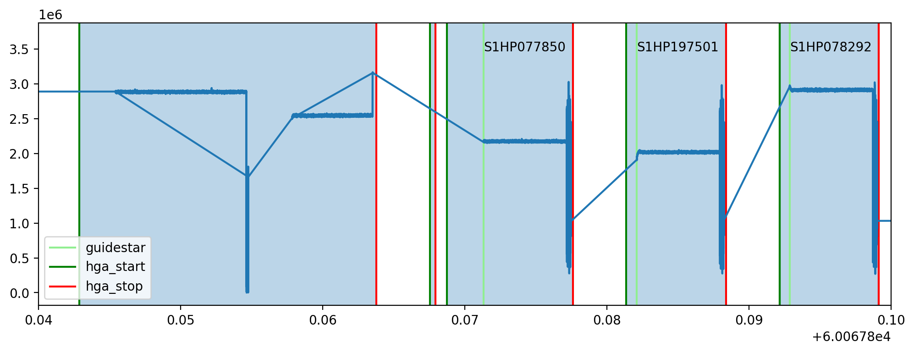
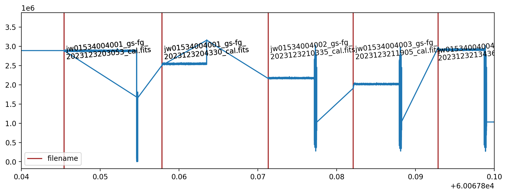

Guidestar Targets Example
=========================

Some programs uses multiple guidestar targets for a given observation.
We can observe the technical functions of the JWST when FGS locks on to
a guidestar and switches to the next using Spelunker. For this example,
we will be exploring Program ID 2079.

.. code:: ipython3

    import sys
    sys.path.append('/Users/ddeal/JWST-FGS-Spelunker/JWST-FGS-spk-main/src/')
    
    import spelunker
    
    spk = spelunker.load('/Users/ddeal/JWST-Treasure-Chest/', pid=1534)

.. parsed-literal::

    Current working directory for spelunker: /Users/ddeal/JWST-Treasure-Chest/spelunker_outputs
    
    Connecting with astroquery...
    INFO: Found cached file ./mastDownload/JWST/jw01534002002_04101_00001_guider2/jw01534002002_gs-fg_2022338021919_cal.fits with expected size 10428480. [astroquery.query]
    INFO: Found cached file ./mastDownload/JWST/jw01534001004_03101_00001_guider1/jw01534001004_gs-fg_2022340010755_cal.fits with expected size 8766720. [astroquery.query]
    INFO: Found cached file ./mastDownload/JWST/jw01534002004_03101_00001_guider2/jw01534002004_gs-fg_2022338025056_cal.fits with expected size 8769600. [astroquery.query]
    INFO: Found cached file ./mastDownload/JWST/jw01534001002_03101_00001_guider1/jw01534001002_gs-fg_2022340003651_cal.fits with expected size 8772480. [astroquery.query]
    INFO: Found cached file ./mastDownload/JWST/jw01534002003_03101_00001_guider2/jw01534002003_gs-fg_2022338023521_cal.fits with expected size 8772480. [astroquery.query]
    INFO: Found cached file ./mastDownload/JWST/jw01534001003_03101_00001_guider1/jw01534001003_gs-fg_2022340005224_cal.fits with expected size 8772480. [astroquery.query]
    INFO: Found cached file ./mastDownload/JWST/jw01534002001_05101_00002_guider2/jw01534002001_gs-fg_2022338014704_cal.fits with expected size 10941120. [astroquery.query]
    INFO: Found cached file ./mastDownload/JWST/jw01534002001_05101_00002_guider2/jw01534002001_gs-fg_2022338015941_cal.fits with expected size 7830720. [astroquery.query]
    INFO: Found cached file ./mastDownload/JWST/jw01534001001_03101_00002_guider1/jw01534001001_gs-fg_2022340000825_cal.fits with expected size 9388800. [astroquery.query]
    INFO: Found cached file ./mastDownload/JWST/jw01534001001_03101_00002_guider1/jw01534001001_gs-fg_2022340002102_cal.fits with expected size 7827840. [astroquery.query]
    INFO: Found cached file ./mastDownload/JWST/jw01534004004_03101_00001_guider2/jw01534004004_gs-fg_2023123213436_cal.fits with expected size 8769600. [astroquery.query]
    INFO: Found cached file ./mastDownload/JWST/jw01534004003_03101_00001_guider2/jw01534004003_gs-fg_2023123211905_cal.fits with expected size 8766720. [astroquery.query]
    INFO: Found cached file ./mastDownload/JWST/jw01534004002_03101_00001_guider2/jw01534004002_gs-fg_2023123210335_cal.fits with expected size 8766720. [astroquery.query]
    INFO: Found cached file ./mastDownload/JWST/jw01534004001_03101_00002_guider2/jw01534004001_gs-fg_2023123203053_cal.fits with expected size 12974400. [astroquery.query]
    INFO: Found cached file ./mastDownload/JWST/jw01534004001_03101_00002_guider2/jw01534004001_gs-fg_2023123204330_cal.fits with expected size 7827840. [astroquery.query]
    INFO: Found cached file ./mastDownload/JWST/jw01534003001_03101_00002_guider1/jw01534003001_gs-fg_2023125174543_cal.fits with expected size 9809280. [astroquery.query]
    INFO: Found cached file ./mastDownload/JWST/jw01534003001_03101_00002_guider1/jw01534003001_gs-fg_2023125175812_cal.fits with expected size 7793280. [astroquery.query]
    INFO: Found cached file ./mastDownload/JWST/jw01534003002_02101_00001_guider1/jw01534003002_gs-fg_2023125181351_cal.fits with expected size 8337600. [astroquery.query]
    INFO: Found cached file ./mastDownload/JWST/jw01534003003_02101_00001_guider1/jw01534003003_gs-fg_2023125182911_cal.fits with expected size 8337600. [astroquery.query]
    INFO: Found cached file ./mastDownload/JWST/jw01534003004_02101_00001_guider1/jw01534003004_gs-fg_2023125185519_cal.fits with expected size 8337600. [astroquery.query]

.. code:: ipython3

    spk.guidestar_plot()

.. parsed-literal::

    <WCSAxes: title={'center': 'Guidestar positions — 1534'}>

.. code:: ipython3

    spk.object_properties

.. raw:: html

    

    
    <table border="1" class="dataframe">
      <thead>
        <tr style="text-align: right;">
          <th></th>
          <th>guidestar_catalog_id</th>
          <th>gaiadr1ID</th>
          <th>gaiadr1ID</th>
          <th>int_start</th>
          <th>int_stop</th>
          <th>ra</th>
          <th>dec</th>
          <th>Jmag</th>
          <th>Hmag</th>
        </tr>
      </thead>
      <tbody>
        <tr>
          <th>0</th>
          <td>S1HP079555</td>
          <td>4658077781377287680</td>
          <td>4658077781376437888</td>
          <td>59917.066396</td>
          <td>59917.074354</td>
          <td>80.837584</td>
          <td>-69.541124</td>
          <td>13.659</td>
          <td>12.898</td>
        </tr>
        <tr>
          <th>1</th>
          <td>S1HP080554</td>
          <td>4658077991763987712</td>
          <td>4658077991799023616</td>
          <td>59917.089163</td>
          <td>59917.096759</td>
          <td>80.806837</td>
          <td>-69.530972</td>
          <td>15.001</td>
          <td>14.282</td>
        </tr>
        <tr>
          <th>2</th>
          <td>S1HP078573</td>
          <td>4657983910572904320</td>
          <td>4657983910572904320</td>
          <td>59917.112547</td>
          <td>59917.118705</td>
          <td>80.807043</td>
          <td>-69.553474</td>
          <td>13.839</td>
          <td>13.078</td>
        </tr>
        <tr>
          <th>3</th>
          <td>S1HP079590</td>
          <td>4657986831103727872</td>
          <td>4657986835382982016</td>
          <td>59918.999015</td>
          <td>59919.005848</td>
          <td>80.510790</td>
          <td>-69.545479</td>
          <td>15.410</td>
          <td>14.839</td>
        </tr>
        <tr>
          <th>4</th>
          <td>S1HP079769</td>
          <td>4657986831078120832</td>
          <td>4657986835433225728</td>
          <td>59919.019436</td>
          <td>59919.025598</td>
          <td>80.518235</td>
          <td>-69.543415</td>
          <td>15.231</td>
          <td>14.341</td>
        </tr>
        <tr>
          <th>5</th>
          <td>S1HP078292</td>
          <td>4657986796681532672</td>
          <td>4657986801073794432</td>
          <td>59919.041018</td>
          <td>59919.047165</td>
          <td>80.519564</td>
          <td>-69.558464</td>
          <td>12.804</td>
          <td>11.883</td>
        </tr>
        <tr>
          <th>6</th>
          <td>S1HP077850</td>
          <td>4657986762384054144</td>
          <td>4657986766713867264</td>
          <td>60067.871344</td>
          <td>60067.877490</td>
          <td>80.573531</td>
          <td>-69.562862</td>
          <td>12.957</td>
          <td>12.227</td>
        </tr>
        <tr>
          <th>7</th>
          <td>S1HP197501</td>
          <td>4657986865463528832</td>
          <td>4657986869793061376</td>
          <td>60067.882117</td>
          <td>60067.888264</td>
          <td>80.571447</td>
          <td>-69.551750</td>
          <td>13.063</td>
          <td>12.168</td>
        </tr>
        <tr>
          <th>8</th>
          <td>S1HP773376</td>
          <td></td>
          <td>4658078124973829632</td>
          <td>60069.733171</td>
          <td>60069.740086</td>
          <td>80.794522</td>
          <td>-69.504084</td>
          <td>13.426</td>
          <td>12.654</td>
        </tr>
        <tr>
          <th>9</th>
          <td>S1HP081366</td>
          <td>4658078056254368128</td>
          <td>4658078056254368128</td>
          <td>60069.753592</td>
          <td>60069.759620</td>
          <td>80.758291</td>
          <td>-69.524143</td>
          <td>12.765</td>
          <td>11.899</td>
        </tr>
        <tr>
          <th>10</th>
          <td>S1HP082164</td>
          <td>4658077953064455552</td>
          <td>4658077957439332608</td>
          <td>60069.764246</td>
          <td>60069.770278</td>
          <td>80.865554</td>
          <td>-69.514107</td>
          <td>12.753</td>
          <td>11.871</td>
        </tr>
      </tbody>
    </table>
    

.. code:: ipython3

    ra = spk.object_properties['ra']
    dec = spk.object_properties['dec']

.. code:: ipython3

    import matplotlib.pyplot as plt
    
    spk.mast_api_token = 'enter_mast_token_id_here'
    
    fig, ax = plt.subplots(figsize=(12,4),dpi=200)
    #ax = spk.mnemonics_local('FILENAME')
    ax = spk.mnemonics_local('GUIDESTAR')
    ax = spk.mnemonics('SA_ZHGAUPST', 60067.84, 60067.9)
    ax.plot(spk.fg_time, spk.fg_flux)
    plt.legend(loc=3)
    
    plt.xlim(60067.84, 60067.9)

.. parsed-literal::

    [60067.842891134256, 60067.863785925925, 60067.86755480324, 60067.8679340625, 60067.86876369213, 60067.877617025464, 60067.88137405093, 60067.88839034722, 60067.89216811342, 60067.89915181713]

.. parsed-literal::

    (60067.84, 60067.9)

.. code:: ipython3

    spk.mast_api_token = '8eedd0a371a44e598a9c4489e3148811'
    
    fig, ax = plt.subplots(figsize=(12,4),dpi=200)
    ax = spk.mnemonics_local('FILENAME')
    
    ax.plot(spk.fg_time, spk.fg_flux)
    plt.legend(loc=3)
    
    plt.xlim(60067.84, 60067.9)

.. parsed-literal::

    (60067.84, 60067.9)

