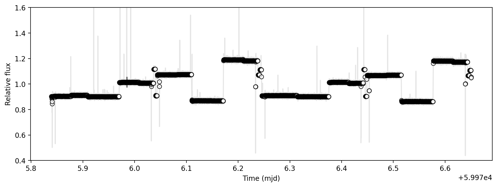
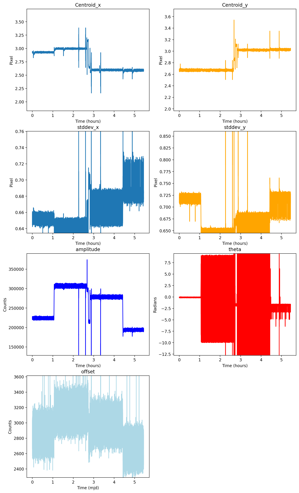
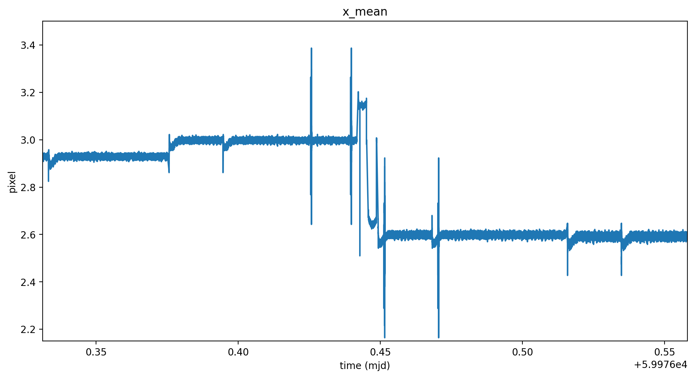
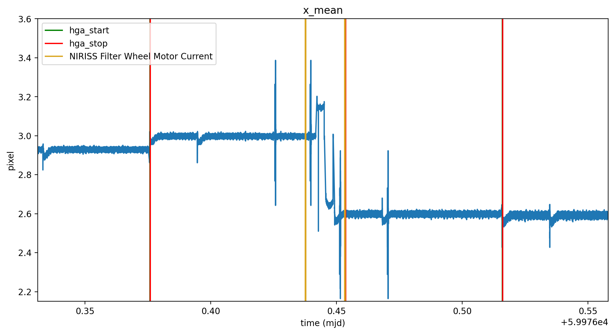
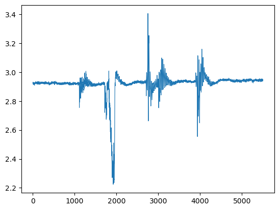
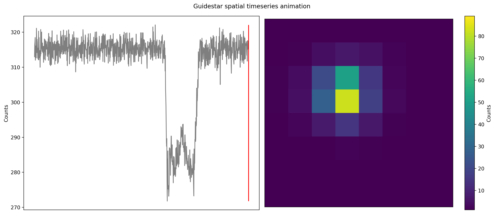

Pixel centroid changes and mnemonics \| PID 2079 Example
========================================================

.. code:: ipython3

    import sys
    sys.path.append('/Users/ddeal/JWST-FGS-Spelunker/JWST-FGS-Spelunker-main/src/')
    import spelunker
    
    spk = spelunker.load('/Users/ddeal/JWST-Treasure-Chest/', pid=2079, obs_num=4, visit=1)

.. code:: ipython3

    spk.mast_api_token = 'enter_mast_token_id_here'

Lets look at how many guidestars this program uses.

.. code:: ipython3

    spk.object_properties

.. raw:: html

    

    
    <table border="1" class="dataframe">
      <thead>
        <tr style="text-align: right;">
          <th></th>
          <th>guidestar_catalog_id</th>
          <th>gaiadr1ID</th>
          <th>gaiadr1ID</th>
          <th>int_start</th>
          <th>int_stop</th>
          <th>ra</th>
          <th>dec</th>
          <th>Jmag</th>
          <th>Hmag</th>
        </tr>
      </thead>
      <tbody>
        <tr>
          <th>0</th>
          <td>S33T007497</td>
          <td>2057488205467609856</td>
          <td>2057488209763935872</td>
          <td>59975.839346</td>
          <td>59975.877272</td>
          <td>53.227801</td>
          <td>-27.900539</td>
          <td>13.761134</td>
          <td>13.248195</td>
        </tr>
      </tbody>
    </table>
    

There is only one guidestar used within this program. Lets look at the
flux timeseries for the guidestar in the program.

.. code:: ipython3

    import matplotlib.pyplot as plt
    
    fig, ax = plt.subplots(figsize=(12,4), dpi=200)
    ax = spk.timeseries_binned_plot(spk.fg_time, spk.fg_flux)

We can see that there are chucks of data points that largely changes in
flux for each chunk. Lets see how the obserbed properties of the target
changes overtime. We fitted gaussians to each frame using
``spk.gauss2d_fit`` and saved the outpput as an astropy table ``dat``
file, so we can load the table here.

.. code:: ipython3

    from astropy.io import ascii
    gaussfit_table = ascii.read('/Users/ddeal/Spelunker-older/JWST-Treasure-Chest-2023/pid2079_observation04_visit1.dat')

.. code:: ipython3

    spk.timeseries_list_plot(gaussfit_table, spk.fg_time)

.. parsed-literal::

    array([[<Axes: title={'center': 'Centroid_x'}>,
            <Axes: title={'center': 'Centroid_y'}>],
           [<Axes: title={'center': 'stddev_x'}>,
            <Axes: title={'center': 'stddev_y'}>],
           [<Axes: title={'center': 'amplitude'}>,
            <Axes: title={'center': 'theta'}>],
           [<Axes: title={'center': 'offset'}>, <Axes: >]], dtype=object)

We can clearly see that there are some periodic changes in the centroids
every 0.2mjd with even smaller changes within. Lets zoom into one of the
centroid plots.

.. code:: ipython3

    fig, ax = plt.subplots(figsize=(12,6), dpi=200)
    
    ax.plot(spk.fg_time, gaussfit_table['x_mean'], linewidth=.8)
    ax.set_ylabel('pixel')
    ax.set_xlabel('time (mjd)')
    ax.set_title('x_mean')
    ax.set_ylim(2.15,3.4)
    ax.set_xlim(59976.03, 59976.05)

.. parsed-literal::

    (59976.03, 59976.05)

We can see there is multiple events happening. First off, there are
certain breaks between the timeseries, which indicates the time where
the FGS was not observing. Everytime the FGS starts observing again, the
flux changes, even though we know the guidestar is the same. This raises
more investigative questions such as why does the flux change after each
observation if we are looking at the same target? Additonally, there
towards 59976.045 mjd, the x centroid slightly decreases within a
fraction of a pixel. This maybe a product of the gaussian function where
pixel sensitivity or wide PSF affects the shape of the Gaussians. There
is also two events that occur on the ends of the timeseries. Lets zoom
into the event on the right and apply mnemonics.

.. code:: ipython3

    import matplotlib.pyplot as plt
    
    fig, ax = plt.subplots(figsize=(12,6), dpi=200)
    
    ax.plot(spk.fg_time, gaussfit_table['x_mean'], linewidth=.8)
    
    ax = spk.mnemonics('SA_ZHGAUPST', 59976.0475, 59976.05)
    ax1 = spk.mnemonics('INIS_FWMTRCURR', 59976.0475, 59976.05)
    
    ax.legend()
    
    ax.set_ylabel('pixel')
    ax.set_xlabel('time (mjd)')
    ax.set_title('x_mean')
    ax.set_ylim(2.1,3.0)
    ax.set_xlim(59976.0475, 59976.0495)

.. parsed-literal::

    (59976.0475, 59976.0495)

We can clearly see that some of the centroid movement can be attributed
to the high-gain antenna (HGA) and even events from the NIRISS Filter
Wheel.

Lastly, lets create a spatial animation of the timeseries for the
guidestar for another event.

.. code:: ipython3

    plt.plot(gaussfit_table['x_mean'][51200:57000], linewidth=.8)
    plt.show()

.. code:: ipython3

    filename = '/Users/ddeal/JWST-Treasure-Chest/event1_2079_xmean.gif'
    spk.flux_spatial_timelapse_animation(spk.fg_array[52000:53000], spk.fg_flux[52000:53000], filename=filename)

.. parsed-literal::

    2023-07-18 21:04:16,308	INFO worker.py:1636 -- Started a local Ray instance.

.. image:: /Users/ddeal/JWST-Treasure-Chest-2023/JWST-FGS-Spelunker-Repos/JWST-FGS-Spelunker/plots/1541movie.gif
   :scale: 20%