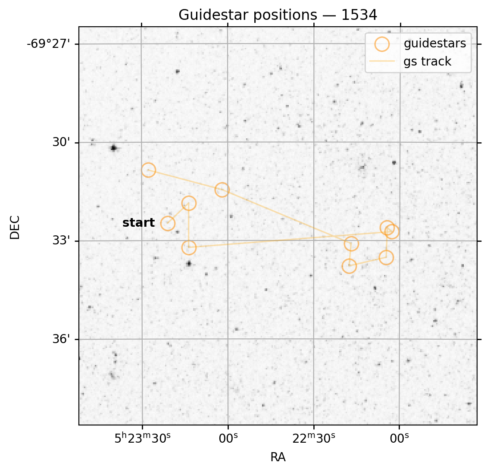

Quickstart
==========

The JWST telescope carries four different instruments: NIRCam, NIRSpec, MIRI and FGS/NIRISS --- the latter containing the 
Fine Guidance Sensor (FGS). FGS Spelunker is a package designed to conveniently analyze guidestar data from.

Installation
------------

To install ``spelunker``, use ``pip install``.

.. code:: bash

   pip install spelunker

For in-depth installation steps, visit :doc:`the installation documentation <installation>`.

Using the library
-----------------

Get started with ``spelunker`` with only two lines of code.

.. code:: python

   import spelunker

   spk = spelunker.load(pid=1534, token='ENTER_MAST_API_TOKEN')

This will download guidestar data for Program ID 1534; the ``spk``
object itself can then be used to explore this guidestar data! Futhermore, you can specify
your MAST API token with the parameter ``token`` to gain access to programs with exclusive rights.
Let us make a plot of the guidestar time-series for the first
minutes of this PID:

.. code:: python

   import matplotlib.pyplot as plt

   # Convert times from MJD to minutes:
   fig, ax = plt.subplots(figsize=(6,2), dpi=200)

   plt.plot( ( spk.fg_time - spk.fg_time[0] ) * 24 * 60, spk.fg_flux, color='black', linewidth=0.2 )

   plt.xlim(0,10)
   plt.ylim(830000,950000)
   plt.xlabel('Time from start (minutes)')
   plt.ylabel('Counts')

.. image:: simple_guidestar_files/timeseries.png
   :width: 500pt
   :align: center

.. raw:: html

   

.. raw:: html

   

(See below on more information that can be extracted, including fitting
2D gaussians to each FGS integration!). 

We can even make a plot of the tracked guidestars within this Program ID. Within 
a selected Program ID, multiple guidestars could be used for each observation. Each 
star or object comes from the Guide Star Catalog (GSC) and is pre-selected depending on 
`telescope pointing and suitability of the star <https://jwst-docs.stsci.edu/jwst-observatory-characteristics/jwst-guide-stars>`_. 
In the generated figure from ``spk.guidestar_plot``, the guidestar positions (marked with an X) 
in the given Program ID are plotted from the *START* to the end of the program. A 
line (``gs track``) is traced between each guidestar to order each used target overtime.

.. code:: python

   spk.guidestar_plot()

.. raw:: html

   

.. raw:: html

   

Mnemonics from JWST technical events can be overplotted on any
timeseries, such as high-gain antenna (HGA) movement or to identify if
the FGS tracks a new guidestar if the `jwstuser package is also
installed <https://github.com/spacetelescope/jwstuser/>`_.

.. code:: python

   import matplotlib.pyplot as plt

   # for mnemonics to work, you will need to specify a MAST API Token in spk.load
   # or you can overwrite the existing token with the attribute spk.mast_api_token.
   spk.mast_api_token = 'insert a token from auth.MAST here'

   fig, ax = plt.subplots(figsize=(12,4),dpi=200)

   ax = spk.mnemonics_local('GUIDESTAR')
   ax = spk.mnemonics('SA_ZHGAUPST', 60067.84, 60067.9) 
   ax.plot(spk.fg_time, spk.fg_flux)
   plt.legend(loc=3)
   plt.xlim(60067.84, 60067.9)
   plt.show()

