Using ``spelunker`` to study JWST Time Series Observations (TSOs)
=================================================================

--------------

**Authors:** Néstor Espinoza (nespinoza@stsci.edu), Derod Deal
(dealderod@ufl.edu) \| **Last update:** Apr 16, 2024

**Program version:** ver. 1.1.9

JWST Time Series Observations (TSOs) are multi-integration exposures
typically targeted at exploring time-varying phenomena: from
exoplanetary transits to accreting material in distant objects.
Guidestar data such as the one ``spelunker`` can query can become very
helpful at exploring this data; this tutorial provides an introduction
on how to use the ``spelunker`` products to analyze it.

1. The case of HAT-P-14 b NIRISS/SOSS observations
==================================================

The first dataset we will be analyzing below comes from an exoplanetary
transit obtained by `Program ID
1541 <https://www.stsci.edu/jwst/science-execution/program-information?id=1541>`__
(PI: Espinoza). This dataset was already introduced in `Albert et
al. (2023) <https://arxiv.org/abs/2306.04572>`__, and consisted of a
transit observation of the exoplanet HAT-P-14 b, which was used to test
the sensitivity and stability of the NIRISS/SOSS instrument during
commissioning.

To start the analysis, let’s load some libraries:

.. code:: ipython3

    import numpy as np
    import matplotlib.pyplot as plt
    
    import spelunker

.. code:: ipython3

    spelunker.__version__

.. parsed-literal::

    '1.1.9'

1.1 Exploring the transit event of HAT-P-14 b
~~~~~~~~~~~~~~~~~~~~~~~~~~~~~~~~~~~~~~~~~~~~~

Let’s first load and plot the NIRISS/SOSS HAT-P-14 b dataset. This is a
lightcurve that was obtained using the ``transitspectroscopy`` pipeline
(`Espinoza, 2022 <https://zenodo.org/records/6960924#.YutMaezMLUI>`__,
and which can be obtained from the ``spelunker`` Github repository
`here <https://raw.githubusercontent.com/GalagaBits/JWST-FGS-Spelunker/main/notebooks/data/hp14_lightcurve.dat>`__;
we extract the time, flux and error on the flux from this data file:

.. code:: ipython3

    t, f, ferr = np.loadtxt('data/hp14_lightcurve.dat', unpack = True, usecols = (0,1,2))

.. code:: ipython3

    tstart = t[0]
    time_since_start = (t-tstart)*24
    
    plt.figure(figsize=(10,4))
    
    plt.errorbar(time_since_start, f, ferr, fmt = '.', 
                             ms = 1, mfc = 'black', mec = 'black', 
                             elinewidth = 1, ecolor = 'black')
    
    plt.title('Exoplanet transit of HAT-P-14 b with NIRISS/SOSS', fontsize = 18)
    plt.xlabel('Time since exposure start (hours)', fontsize = 18)
    plt.ylabel('Relative flux', fontsize = 18)
    
    plt.xticks(fontsize=16)
    plt.yticks(fontsize=16)
    
    plt.xlim(np.min(time_since_start), np.max(time_since_start))
    plt.show()

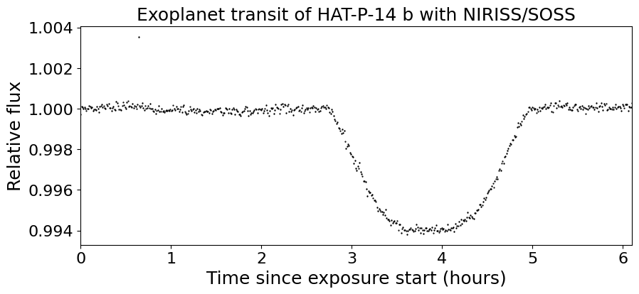

All right. This time-series shows a nice transit event from about hour
2.75 since exposure start, all the way until about hour 5. Aside from
the transit event, however, there is an evident oscillation in the data,
which is evident if we do a zoom to the first three hours of data:

.. code:: ipython3

    tstart = t[0]
    time_since_start = (t-tstart)*24
    
    plt.figure(figsize=(10,4))
    
    plt.plot(time_since_start, (f-1)*1e6, color = 'black')
    plt.errorbar(time_since_start, (f-1)*1e6, ferr*1e6, fmt = '.', 
                             ms = 1, mfc = 'black', mec = 'black', 
                             elinewidth = 1, ecolor = 'black')
    
    plt.title('Exoplanet transit of HAT-P-14 b with NIRISS/SOSS (zoom)', fontsize = 18)
    plt.xlabel('Time since exposure start (hours)', fontsize = 18)
    plt.ylabel('Relative flux - 1 (ppm)', fontsize = 18)
    
    plt.xticks(fontsize=16)
    plt.yticks(fontsize=16)
    
    plt.xlim(np.min(time_since_start), 3)
    plt.ylim(-500, 500)
    
    plt.show()

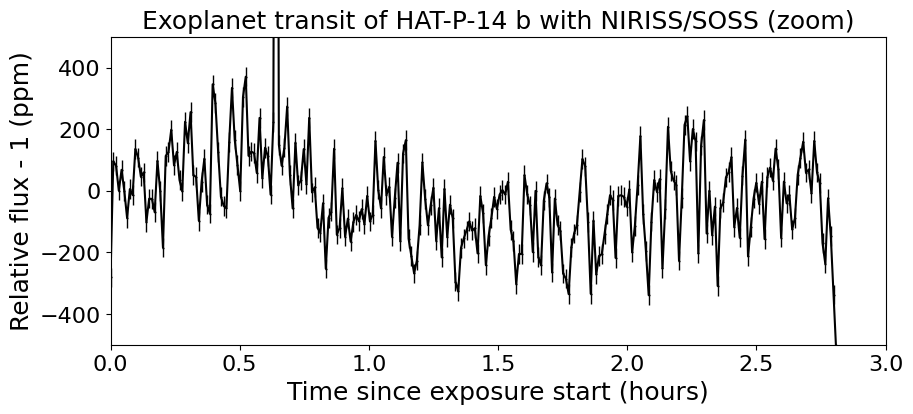

The light curve has at least two oscillation patterns. One is a
long-term one, on which the light curve seems to rise at about hour 0.5
after start, then go down until about hour 1, and then oscillate up
again at about hour 3. The other is a short-frequency oscillation, with
a period of about ~5 minutes. The amplitude of those oscillations is
small — around 200 ppm.

Big question is: are those oscillations really happening on HAT-P-14
(the star)? Or is this an instrumental effect? Let’s now explore the
guidestar data to find this out.

1.2 Exploring the guidestar data of PID 1541
~~~~~~~~~~~~~~~~~~~~~~~~~~~~~~~~~~~~~~~~~~~~

Let’s use ``spelunker`` to load the guidestar data for this Program
ID/observation/visit. To get these values, one can explore the Program
Information webpage for the program
`here <https://www.stsci.edu/jwst/science-execution/program-information?id=1541>`__
and click on the `“Visit Status Information”
page <https://www.stsci.edu/jwst/science-execution/program-information?id=1541>`__
that will present this data to a user. In our case, this dataset
corresponds to PID 1541, observation number 1 and visit 1:

.. code:: ipython3

    spk = spelunker.load(pid=1541, obs_num='1', visit='1', save=True)

.. parsed-literal::

    Current working directory for spelunker: /Users/nespinoza/github/JWST-FGS-Spelunker/notebooks/spelunker_outputs
    
    Connecting with astroquery...

Let’s check the time-series of the guidestar data:

.. code:: ipython3

    plt.figure(figsize=(10,4))
    
    fg_time_since_start = (spk.fg_time + 2400000.5 - tstart) * 24
    
    plt.plot(fg_time_since_start, spk.fg_flux / np.nanmedian( spk.fg_flux ) , color = 'tomato')
    
    plt.title('Guidestar flux for PID 1541, visit 1, observation 1', fontsize = 18)
    plt.xlabel('Time since exposure start (hours)', fontsize = 18)
    plt.ylabel('Relative flux', fontsize = 18)
    
    plt.ylim(0.5,1.5)
    plt.xticks(fontsize=16)
    plt.yticks(fontsize=16)
    
    plt.xlim(np.min(time_since_start), np.max(time_since_start))
    plt.show()

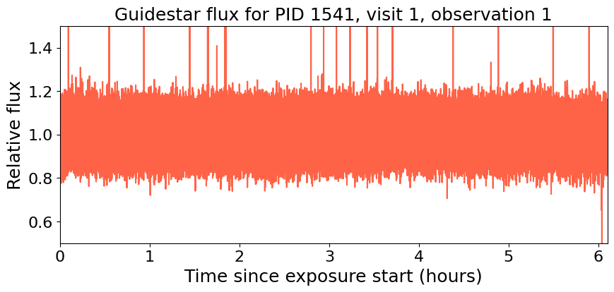

The raw photometry from the guidestar varies by a lot more than our
target star due to random noise in the very high cadence JWST FGS data.
Let’s bin the FGS time-series to the same cadence as the science
time-series, which will allow us to see more structure in the data. To
this end, let’s write a function that does this:

.. code:: ipython3

    def bin_fgs_to_science(tscience, tfgs, ffgs):
        """
        This function bins an FGS time-series defined by the times `tfgs` and fluxes `ffgs`, to times `tscience`. 
        The function assumes that (1) `tscience` are times obtained at pseudo-regular intervals (i.e., that times 
        on `tscience` next to each other are similar), and that (2) `tscience` is ordered in chronological order.
        """
    
        nscience = len(tscience)
        binned_fgs = np.zeros( nscience )
        binned_fgs_err = np.zeros( nscience )
        for i in range( nscience ):
    
            if i == 0:
    
                dt = tscience[1] - tscience[0] 
    
            elif i == nscience - 1:
    
                dt = tscience[-1] - tscience[-2]
    
            else:
    
                dt1 = tscience[i] - tscience[i-1]
                dt2 = tscience[i+1] - tscience[i]
                dt = ( dt1 + dt2 ) * 0.5
                
            idx = np.where( np.abs(tscience[i] - tfgs) < 0.5*dt )[0]
            binned_fgs[i] = np.mean( ffgs[idx] )
            binned_fgs_err[i] = np.sqrt( np.var( ffgs[idx] ) ) / np.sqrt( len(idx) )
    
        return binned_fgs, binned_fgs_err

.. code:: ipython3

    fbin, fbinerr = bin_fgs_to_science(time_since_start, fg_time_since_start, spk.fg_flux / np.nanmedian( spk.fg_flux ))

.. code:: ipython3

    plt.figure(figsize=(10,4))
    
    plt.errorbar(time_since_start, (fbin-1)*1e6, fbinerr*1e6, color = 'tomato')
    
    plt.title('(Binned) GS flux for PID 1541, visit 1, observation 1', fontsize = 18)
    plt.xlabel('Time since exposure start (hours)', fontsize = 18)
    plt.ylabel('Relative flux (ppm)', fontsize = 18)
    
    plt.ylim(1.0-0.05,1+0.05)
    plt.xticks(fontsize=16)
    plt.yticks(fontsize=16)
    
    plt.ylim(-10000, 10000)
    plt.xlim(np.min(time_since_start), 3)
    plt.show()

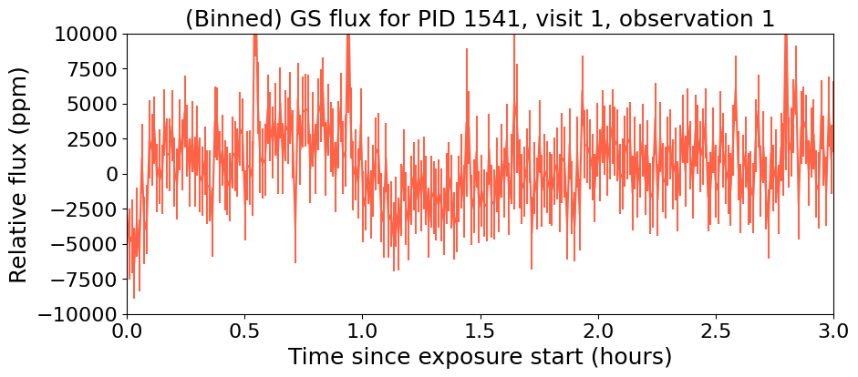

This actually resembles the science time-series quite nicely, although
at a different amplitude. Let’s plot both on the same figure:

.. code:: ipython3

    tstart = t[0]
    time_since_start = (t-tstart)*24
    
    plt.figure(figsize=(10,4))
    
    plt.plot(time_since_start, (f-1)*1e6, color = 'black', label = 'NIRISS/SOSS TSO')
    
    plt.plot(time_since_start, (fbin-1)*1e6*0.05, color = 'tomato', label = r'FGS Guidestar Flux TSO $\times$ 0.05')
    
    plt.legend()
    plt.xlabel('Time since exposure start (hours)', fontsize = 18)
    plt.ylabel('Relative flux - 1 (ppm)', fontsize = 18)
    
    plt.xticks(fontsize=16)
    plt.yticks(fontsize=16)
    
    plt.xlim(np.min(time_since_start), 3)
    plt.ylim(-500, 500)
    
    plt.show()

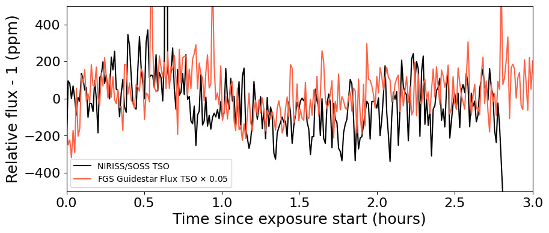

Remarkable! The amplitude might need some tweaking, but it seems this
can, indeed, help track some lightcurve variations. Let’s look next at
other features that could be correlated with instrumental systematics.

1.3 More, more! Correlating PSF Guidestar properties to JWST TSOs
~~~~~~~~~~~~~~~~~~~~~~~~~~~~~~~~~~~~~~~~~~~~~~~~~~~~~~~~~~~~~~~~~

``spelunker`` can also fit Gaussians to each of the 2D FG frames, and
extract more precise parameters than the simple “crude” photometry
described above. This takes a while (a few minutes), so we need to be a
bit patient. Note there’s a series of messages that appear below — these
come from ``ray``, a multi-processing library ``spelunker`` uses in the
background. None of the errors are important for our particular
application.

.. code:: ipython3

    spk.gauss2d_fit(ncpus=4)

.. code:: ipython3

    results = {}
    
    for key in list(spk.gaussfit_results.keys()):
    
        results[key], _ = bin_fgs_to_science(time_since_start, 
                                             fg_time_since_start, 
                                             spk.gaussfit_results[key].value)

.. code:: ipython3

    print(results.keys())

.. parsed-literal::

    dict_keys(['amplitude', 'x_mean', 'y_mean', 'x_stddev', 'y_stddev', 'theta', 'offset'])

Let’s plot all of those parameters for the entire duration of the TSO:

.. code:: ipython3

    for key in list(results.keys()):
    
        plt.figure(figsize=(10,4))
    
        median = np.nanmedian(results[key])
        std = np.nanmedian(np.abs(results[key] - median)) * 1.4826
        plt.plot(time_since_start, results[key], color = 'tomato')
        
        plt.title(key+' for FGS 2D Gaussian Fit', fontsize = 18)
        plt.xlabel('Time since exposure start (hours)', fontsize = 18)
        plt.ylabel(key, fontsize = 18)
        
        plt.xticks(fontsize=16)
        plt.yticks(fontsize=16)
        
        plt.xlim(np.min(time_since_start), np.max(time_since_start))
        plt.ylim(median-3*std,median+5*std)
    
    plt.show()

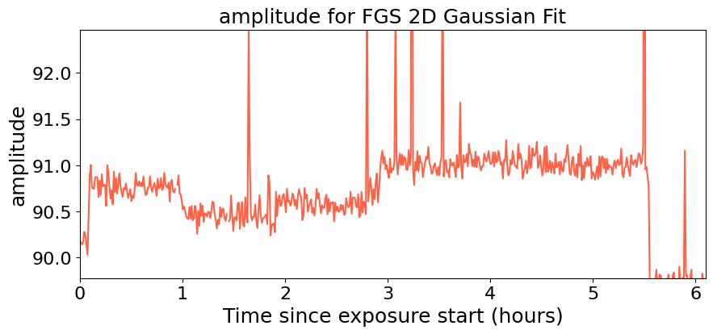

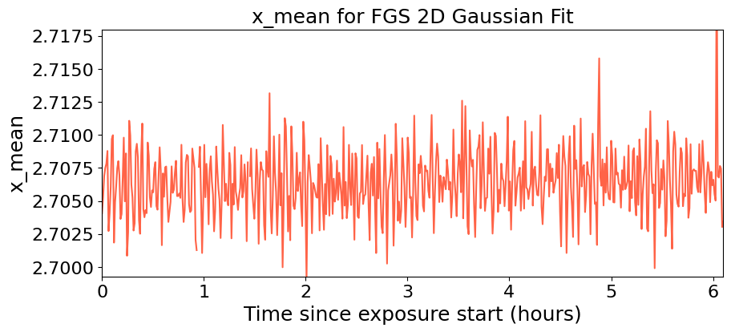

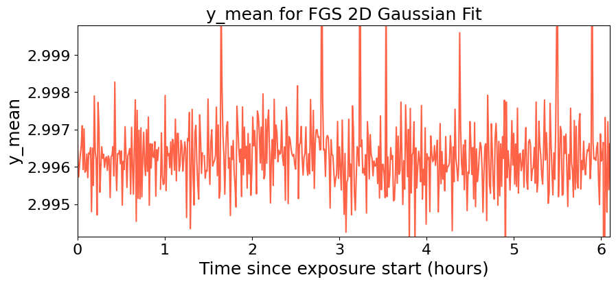

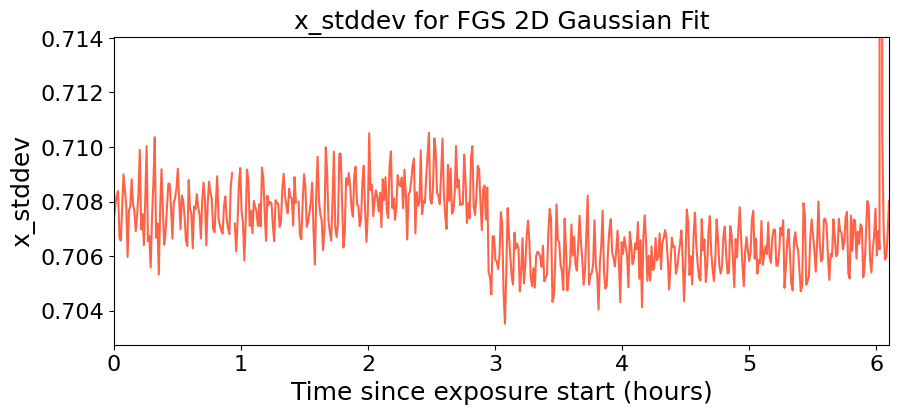

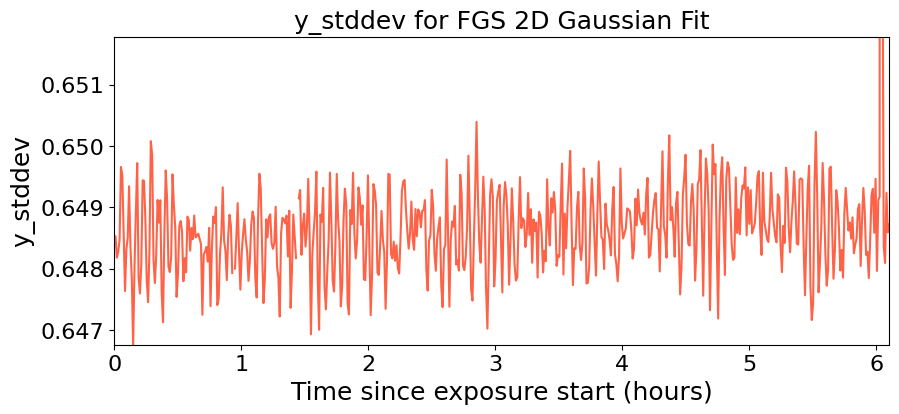

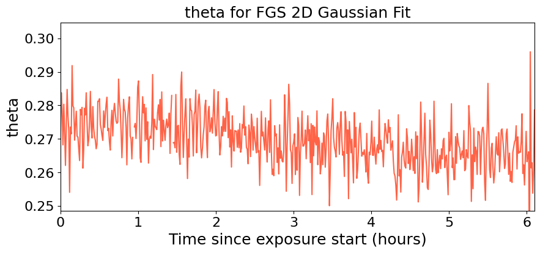

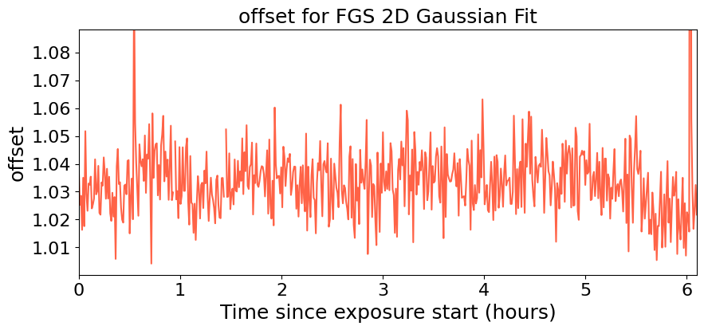

Neat! Many things to unpack.

First, note how the position in X (``x_mean``) and the standard
deviation in this direction (``x_stddev``), together with the standard
deviation on the y-direction (``y_stddev``) and the rotation angle of
the gaussian (``theta``) all oscillate in short frequency, in concert
with the science TSO. Let’s compare those time-series on top of the
science TSO for the first three hours. To do this, let’s create a helper
function that standarizes our regressors:

.. code:: ipython3

    def standarize(x):
    
        median = np.nanmedian(x)
        std = np.nanmedian(np.abs(x - median)) * 1.4826    
    
        return ( x - median ) / std

.. code:: ipython3

    variable = 'x_mean'
    
    plt.figure(figsize=(10,4))
    
    plt.plot(time_since_start, (f-1)*1e6, color = 'black', label = 'NIRISS/SOSS TSO')
    
    plt.plot(time_since_start, standarize(results[variable])*100*(-1), 
             color = 'tomato', label = r'FGS '+variable+r' $\times$ -100')
    
    plt.legend()
    plt.xlabel('Time since exposure start (hours)', fontsize = 18)
    plt.ylabel('Relative flux - 1 (ppm)', fontsize = 18)
    
    plt.xticks(fontsize=16)
    plt.yticks(fontsize=16)
    
    plt.xlim(np.min(time_since_start), 3)
    plt.ylim(-500, 500)
    
    plt.show()

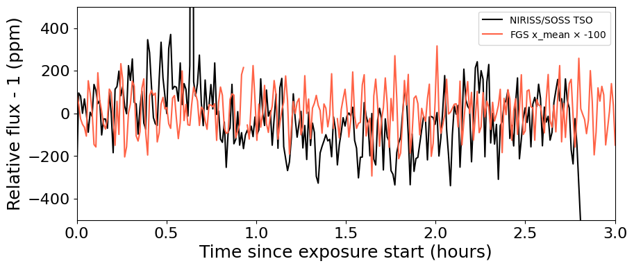

Very nice correlation between variables! Also, note how the x-standard
deviation detects what appears to be a small “tilt event” —
`un-commanded changes of the primary mirror
segments <https://jwst-docs.stsci.edu/methods-and-roadmaps/jwst-time-series-observations/jwst-time-series-observations-noise-sources#JWSTTimeSeriesObservationsNoiseSources-%22Tilt%22events>`__,
believed to happen due to release of stored stresses in the mirror
(`Lajoie et al.,
2023 <https://www.stsci.edu/files/live/sites/www/files/home/jwst/documentation/technical-documents/_documents/JWST-STScI-008497.pdf>`__)
— and which manifest as abrupt PSF position and shape changes:

.. code:: ipython3

    plt.figure(figsize=(10,4))
    
    plt.plot(time_since_start, results['x_stddev'], color = 'tomato')
        
    plt.title('X-standard deviation for FGS 2D Gaussian Fit', fontsize = 18)
    plt.xlabel('Time since exposure start (hours)', fontsize = 18)
    plt.ylabel('$\sigma_X$ (pix)', fontsize = 18)
        
    plt.xticks(fontsize=16)
    plt.yticks(fontsize=16)
    plt.ylim(0.7025,0.7115)
    plt.xlim(np.min(time_since_start), np.max(time_since_start))
    
    plt.show()

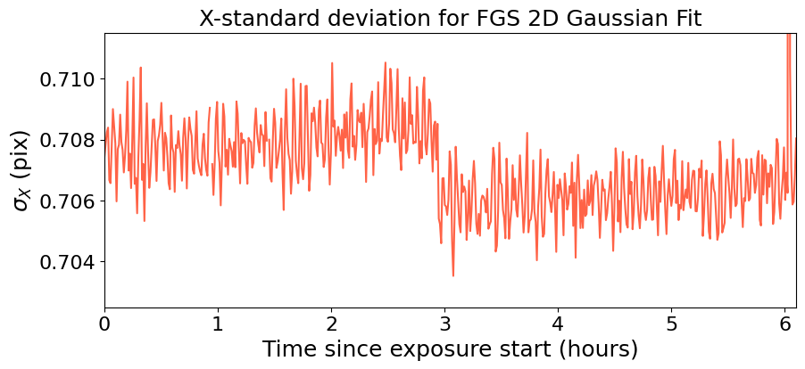

Seeing this from the actual TSO is quite difficult, because the tilt
event happened *just* during ingress:

.. code:: ipython3

    plt.figure(figsize=(10,4))
    
    plt.errorbar(time_since_start, f, ferr, fmt = '.', 
                             ms = 1, mfc = 'black', mec = 'black', 
                             elinewidth = 1, ecolor = 'black')
    
    plt.xlabel('Time since exposure start (hours)', fontsize = 18)
    plt.ylabel('Relative flux', fontsize = 18)
    
    
    plt.xlim(np.min(time_since_start), np.max(time_since_start))
    plt.ylim(0.993, 1.001)
    
    plt.xticks(fontsize=16)
    plt.yticks(fontsize=16)
    
    plt.twinx()
    variable = 'x_stddev'
    plt.plot(time_since_start, results[variable], 
             color = 'tomato', label = r'FGS '+variable)
    
    plt.ylim(0.7025,0.7115)
    
    plt.ylabel('$\sigma_X$ (pix)', fontsize = 18, color = 'tomato')
    
    plt.yticks(fontsize=16, color = 'tomato')
    
    plt.show()

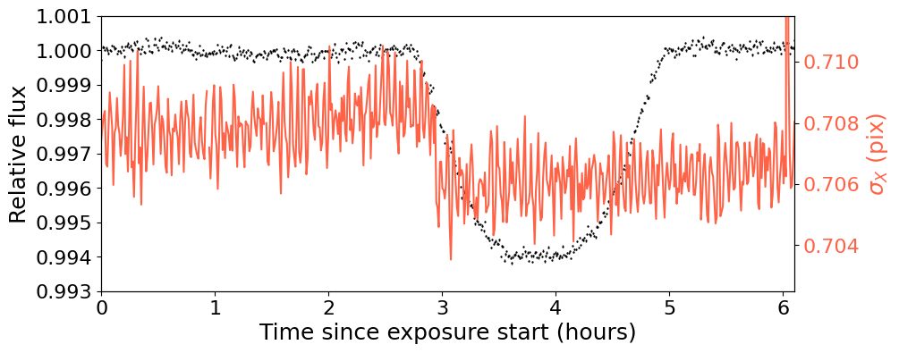

To showcase further the beauty of ``spelunker`` as a TSO event detector,
let’s analyze one more dataset on which the tilt event is obvious: the
ERS observations of WASP-39 b with NIRSpec/G395H.

2. The case of WASP-39 b NIRSpec/G395H observations
===================================================

Let’s repeat the analysis for the transit WASP-39 b with NIRSpec/G395H.
Let’s study the NRS1 lightcurve presented in `Alderson et
al. (2023) <https://www.nature.com/articles/s41586-022-05591-3>`__. This
lightcurve, as the one for HAT-P-14 b introduced above, was also
generated using the ``transitspectroscopy`` pipeline — we have uploaded
this to this Github repository as well
`here <https://raw.githubusercontent.com/GalagaBits/JWST-FGS-Spelunker/main/notebooks/data/w39_lightcurve.dat>`__.
We extract the time, flux and error on the flux:

.. code:: ipython3

    t, f, ferr = np.loadtxt('data/w39_lightcurve.dat', unpack = True, usecols = (0,1,2))

.. code:: ipython3

    tstart = t[0]
    time_since_start = (t-tstart)*24
    
    plt.figure(figsize=(10,4))
    
    plt.errorbar(time_since_start, f, ferr, fmt = '.', 
                             ms = 1, mfc = 'black', mec = 'black', 
                             elinewidth = 1, ecolor = 'black')
    
    plt.title('Exoplanet transit of WASP-39b with NIRSpec/G395H', fontsize = 18)
    plt.xlabel('Time since exposure start (hours)', fontsize = 18)
    plt.ylabel('Relative flux', fontsize = 18)
    
    plt.xticks(fontsize=16)
    plt.yticks(fontsize=16)
    
    plt.xlim(np.min(time_since_start), np.max(time_since_start))
    
    plt.show()

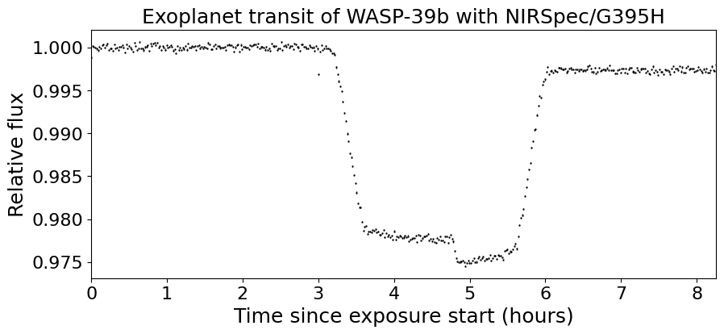

Note that break in the transit light curve? That’s a tilt event. One
that ``spelunker`` can also detect! Let’s run the ``spelunker`` magic
for this program, which is `PID 1366 (PI: Batalha, co-PI: Bean,
Stevenson) <https://www.stsci.edu/jwst/science-execution/program-information?id=1366>`__.
This, in particular, is observation number 3, visit 1:

.. code:: ipython3

    spk = spelunker.load(pid=1366, obs_num='3', visit='1', save=True)

.. parsed-literal::

    Current working directory for spelunker: /Users/nespinoza/github/JWST-FGS-Spelunker/notebooks/spelunker_outputs
    
    Connecting with astroquery...

Let’s explore the guidestar (binned) photometry:

.. code:: ipython3

    fg_time_since_start = (spk.fg_time + 2400000.5 - tstart) * 24
    fbin, fbinerr = bin_fgs_to_science(time_since_start, fg_time_since_start, spk.fg_flux / np.nanmedian( spk.fg_flux ))

.. code:: ipython3

    plt.figure(figsize=(10,4))
    
    plt.errorbar(time_since_start, (fbin-1)*1e6, fbinerr*1e6, color = 'tomato')
    
    plt.title('(Binned) GS flux for PID 1541, visit 1, observation 1', fontsize = 18)
    plt.xlabel('Time since exposure start (hours)', fontsize = 18)
    plt.ylabel('Relative flux (ppm)', fontsize = 18)
    
    plt.xticks(fontsize=16)
    plt.yticks(fontsize=16)
    
    plt.xlim(np.min(time_since_start), np.max(time_since_start))
    
    plt.show()

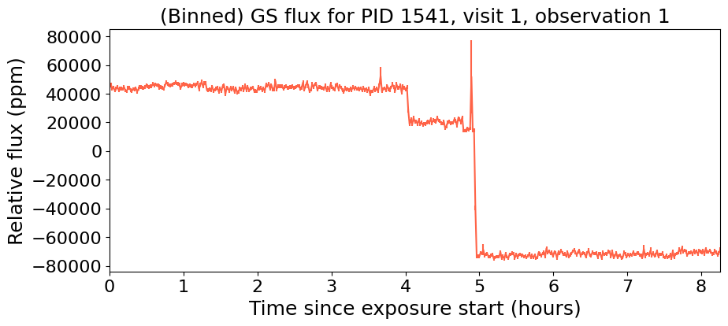

Oh my. It’s not only one, but perhaps…two, three tilt events?:

.. code:: ipython3

    tstart = t[0]
    time_since_start = (t-tstart)*24
    
    plt.figure(figsize=(10,4))
    
    plt.errorbar(time_since_start, f, ferr, fmt = '.', 
                             ms = 1, mfc = 'black', mec = 'black', 
                             elinewidth = 1, ecolor = 'black')
    
    plt.xlabel('Time since exposure start (hours)', fontsize = 18)
    plt.ylabel('Relative flux', fontsize = 18)
    
    plt.xticks(fontsize=16)
    plt.yticks(fontsize=16)
    
    plt.xlim(np.min(time_since_start), np.max(time_since_start))
    
    plt.twinx()
    
    plt.errorbar(time_since_start, (fbin-1)*1e6, fbinerr*1e6, color = 'tomato')
    
    plt.ylabel('Relative flux (FGS)', fontsize = 18, color = 'tomato')
    
    plt.xticks(fontsize=16)
    plt.yticks(fontsize=16, color = 'tomato')
    
    plt.show()

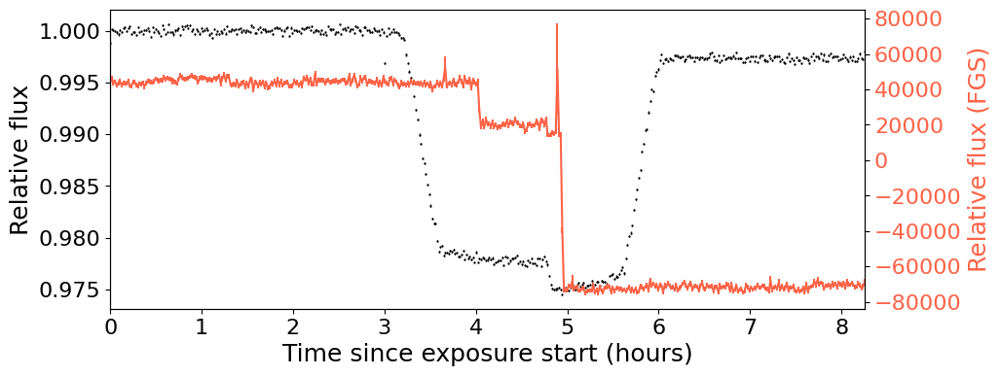

Very interesting. Let’s explore the gaussian fits to the data:

.. code:: ipython3

    spk.gauss2d_fit(ncpus=4)

Let’s bin this to the science time-stamps:

.. code:: ipython3

    results = {}
    
    for key in list(spk.gaussfit_results.keys()):
    
        results[key], _ = bin_fgs_to_science(time_since_start, 
                                             fg_time_since_start, 
                                             spk.gaussfit_results[key].value)

Let’s go right away to the X standard deviation:

.. code:: ipython3

    plt.figure(figsize=(10,4))
    
    plt.errorbar(time_since_start, f, ferr, fmt = '.', 
                             ms = 1, mfc = 'black', mec = 'black', 
                             elinewidth = 1, ecolor = 'black')
    
    plt.xlabel('Time since exposure start (hours)', fontsize = 18)
    plt.ylabel('Relative flux', fontsize = 18)
    
    
    plt.xlim(np.min(time_since_start), np.max(time_since_start))
    
    plt.xticks(fontsize=16)
    plt.yticks(fontsize=16)
    
    plt.twinx()
    variable = 'x_stddev'
    plt.plot(time_since_start, results[variable], 
             color = 'tomato', label = r'FGS '+variable)
    
    plt.ylabel('$\sigma_X$ (pix)', fontsize = 18, color = 'tomato')
    
    plt.yticks(fontsize=16, color = 'tomato')
    
    plt.show()

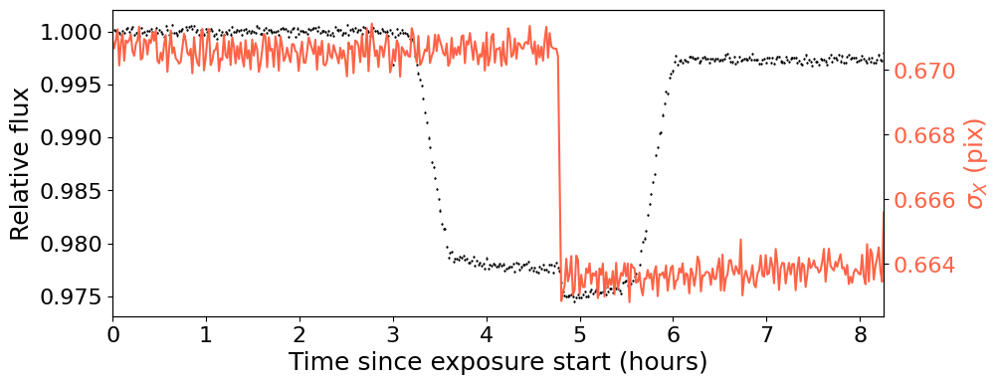

Very interesting! The “tilt” event is beautifully detected by the
guidestar data. Best of all, we can see the event at any resolution we
want thanks to it, because the FGS data has much higher tempoeral
resolution that the TSO data itself. Let’s write a function that can bin
the data at any temporal resolution so we can see this in action:

.. code:: ipython3

    def bin_data(x,y,n_bin):
        
        x_bins = []
        y_bins = []
        y_err_bins = []
        
        for i in range(0,len(x),n_bin):
            
            x_bins.append(np.median(x[i:i+n_bin-1]))
            y_bins.append(np.median(y[i:i+n_bin-1]))
            y_err_bins.append(np.sqrt(np.var(y[i:i+n_bin-1]))/np.sqrt(len(y[i:i+n_bin-1])))
            
        return np.array(x_bins),np.array(y_bins),np.array(y_err_bins)

.. code:: ipython3

    plt.figure(figsize=(10,4))
    
    plt.errorbar(time_since_start, f, ferr, fmt = 'o', 
                             ms = 5, mfc = 'black', mec = 'black', 
                             elinewidth = 1, ecolor = 'black')
    
    plt.xlabel('Time since exposure start (hours)', fontsize = 18)
    plt.ylabel('Relative flux', fontsize = 18)
    
    
    plt.xlim(4.5,5.0)
    plt.ylim(0.973, 0.980)
    
    plt.xticks(fontsize=16)
    plt.yticks(fontsize=16)
    
    plt.twinx()
    
    variable = 'x_stddev'
    plt.plot(time_since_start, results[variable], 
             color = 'tomato', label = r'FGS '+variable)
    
    tbin, ybin, _ = bin_data((spk.fg_time + 2400000.5 - tstart) * 24, spk.gaussfit_results[variable].value, n_bin = 300)
    plt.plot(tbin, ybin, '.-',
             color = 'red', alpha = 0.3)
    
    plt.plot(time_since_start, results[variable], 
             'o', color = 'tomato')
    
    plt.xlim(4.5,5.0)
    plt.ylim(0.66,0.675)
    
    plt.ylabel('$\sigma_X$ (pix)', fontsize = 18, color = 'tomato')
    
    plt.yticks(fontsize=16, color = 'tomato')
    
    plt.show()

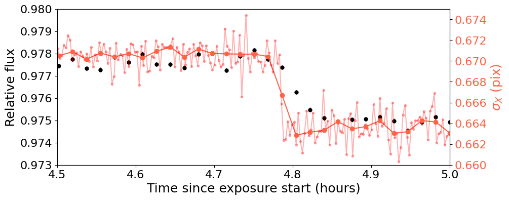

Interestingly, in this case, the Y-standard deviation samples the event
even better, when considering the amplitude of the “jump” in this time
series to the overall scatter of the time-series for the Y-standard
deviation itself, :math:`\sigma_Y`:

.. code:: ipython3

    plt.figure(figsize=(10,4))
    
    plt.errorbar(time_since_start, f, ferr, fmt = 'o', 
                             ms = 5, mfc = 'black', mec = 'black', 
                             elinewidth = 1, ecolor = 'black')
    
    plt.xlabel('Time since exposure start (hours)', fontsize = 18)
    plt.ylabel('Relative flux', fontsize = 18)
    
    
    plt.xlim(4.5,5.0)
    plt.ylim(0.973, 0.980)
    
    plt.xticks(fontsize=16)
    plt.yticks(fontsize=16)
    
    plt.twinx()
    
    variable = 'y_stddev'
    plt.plot(time_since_start, results[variable], 
             color = 'cornflowerblue', label = r'FGS '+variable)
    
    tbin, ybin, _ = bin_data((spk.fg_time + 2400000.5 - tstart) * 24, spk.gaussfit_results[variable].value, n_bin = 300)
    plt.plot(tbin, ybin, '.-',
             color = 'cornflowerblue', alpha = 0.3)
    
    plt.plot(time_since_start, results[variable], 
             'o', color = 'cornflowerblue')
    
    plt.xlim(4.5,5.0)
    plt.ylim(0.58,0.63)
    
    plt.ylabel('$\sigma_Y$ (pix)', fontsize = 18, color = 'cornflowerblue')
    
    plt.yticks(fontsize=16, color = 'cornflowerblue')
    
    plt.show()

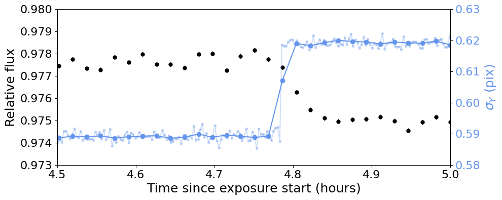

It is very interesting how while the change of the PSF in the guidestar
is almost instantaneous, the PSF change in the TSO is slightly smoother.
This smooth behavior is actually quite nicely tracked by the mean
positions:

.. code:: ipython3

    plt.figure(figsize=(10,4))
    
    plt.errorbar(time_since_start, f, ferr, fmt = 'o', 
                             ms = 5, mfc = 'black', mec = 'black', 
                             elinewidth = 1, ecolor = 'black')
    
    plt.xlabel('Time since exposure start (hours)', fontsize = 18)
    plt.ylabel('Relative flux', fontsize = 18)
    
    
    plt.xlim(4.5,5.0)
    plt.ylim(0.973, 0.980)
    
    plt.xticks(fontsize=16)
    plt.yticks(fontsize=16)
    
    plt.twinx()
    
    variable = 'y_mean'
    plt.plot(time_since_start, results[variable], 
             color = 'cornflowerblue', label = r'FGS '+variable)
    
    tbin, ybin, _ = bin_data((spk.fg_time + 2400000.5 - tstart) * 24, spk.gaussfit_results[variable].value, n_bin = 300)
    plt.plot(tbin, ybin, '.-',
             color = 'cornflowerblue', alpha = 0.3)
    
    plt.plot(time_since_start, results[variable], 
             'o', color = 'cornflowerblue')
    
    plt.xlim(4.5,5.0)
    plt.ylim(3.71,3.74)
    
    plt.ylabel('$Y$ (pix)', fontsize = 18, color = 'cornflowerblue')
    
    plt.yticks(fontsize=16, color = 'cornflowerblue')
    
    plt.show()

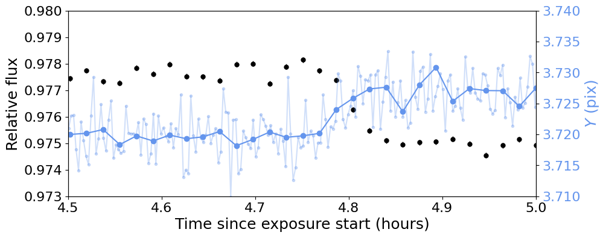

It is this availability of derived products from the FGS frames what
makes this data so rich and powerful when compared against science data.
In particular, the different ways in which different FGS parameters
might correlate with the science data might be useful to decorrelate the
science time-series itself, which might help correcting for events such
as the ones showcased above.
