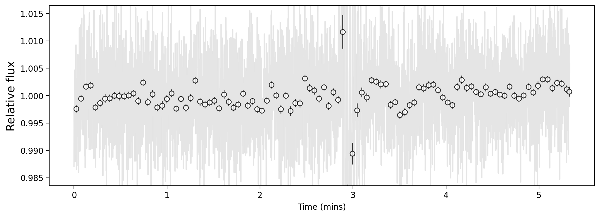
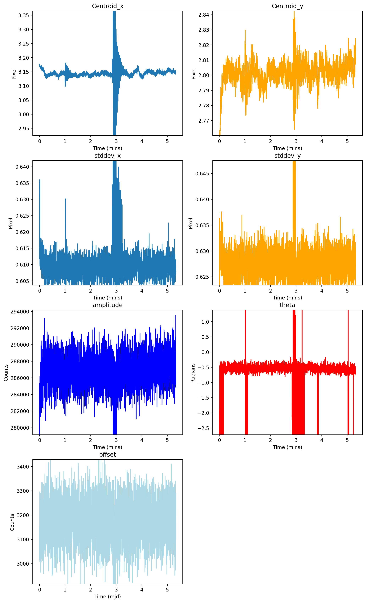
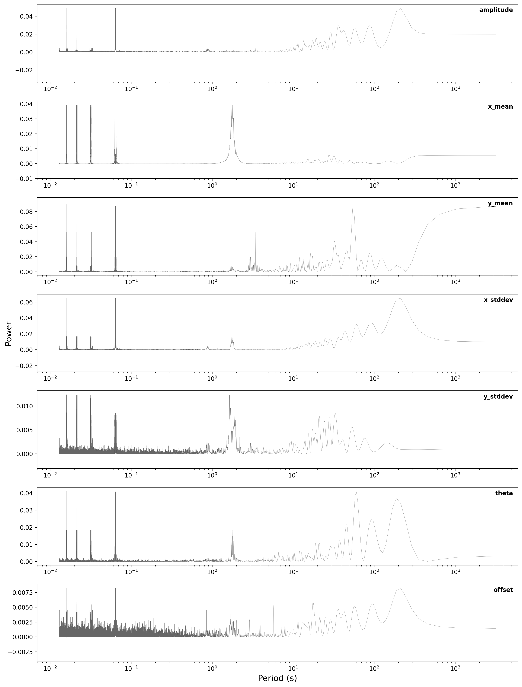
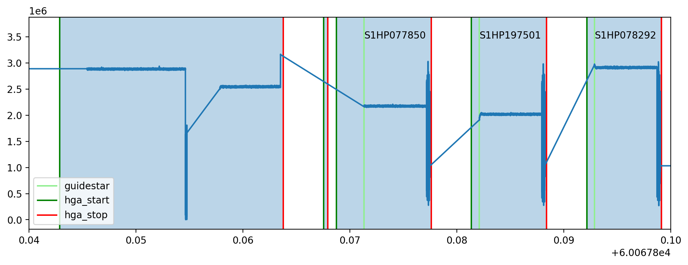
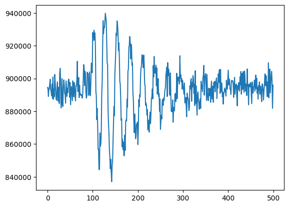
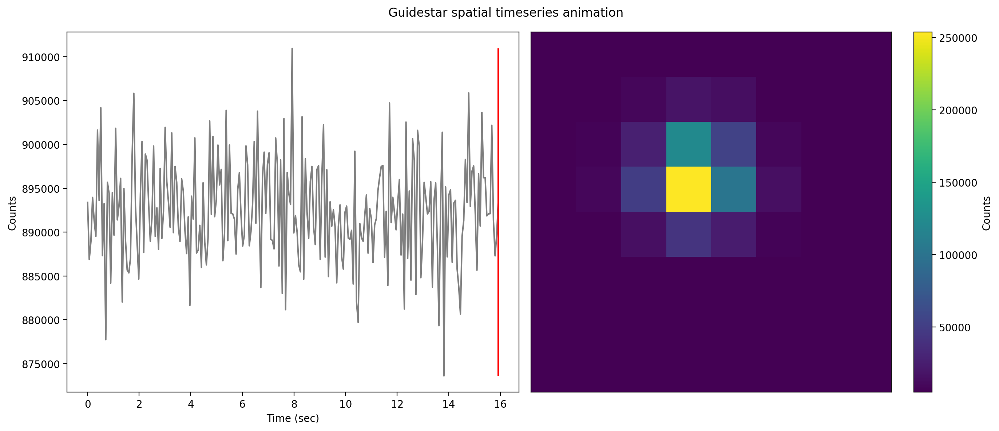

Spelunker Guidestar Tools
========================

--------------

**Authors:** Derod Deal (dealderod@ufl.edu), Néstor Espinoza
(nespinoza@stsci.edu) \| **Last update:** July 24, 2023

**Program version:** ver. 1.0.1

The JWST telescope carries four different instruments: NIRCam, NIRSpec,
MIRI and FGS/NIRISS — the latter containing the Fine Guidance Sensor
(FGS). FGS Spelunker is a package designed to conveniently analyze
guidestar data. In this notebook, we cover the following main functions
of this package.

1. `Getting started <#getting-started>`__

   -  Installation
   -  Using ``Spelunker``

2. `Downloading data <#downloading-data>`__
3. Spatial fitting guide stars

   -  `Gaussian fitting <#gaussian-fitting>`__
   -  `Quick fitting <#quick-fitting>`__

4. `Plotting parameters <#plotting-parameters>`__
5. Periodograms

   -  `Creating a periodogram <#periodograms>`__

6. `Mnemonics <#mnemonics>`__
7. `Animations <#animations>`__
8. `Getting tables <#getting-tables>`__

Getting started
===============

To get started with FGS Spelunker, first call ``spelunker.load`` into a
variable while setting a given Program ID.

.. code:: ipython3

    import os
    import sys
    os.chdir('/Users/ddeal/JWST-Treasure-Chest/')
    sys.path.append('/Users/ddeal/JWST-FGS-Spelunker/JWST-FGS-spk-main/src/')

.. code:: python

   import spelunker
   spk = spelunker.load(pid=1534)

Calling load without the pid parameter ``spelunker.load()`` will
initialize ``spelunker`` without downloading any of the files. This is
useful if you already have timeseries arrays to work with.

Downloading data
----------------

To load Spelunker with a given Program ID for JWST, simply call
``spelunker.load`` with the Program ID ``pid`` as a parameter. This will
create a directory called ``spelunker_results``, which is where the FITS
files from a selected Program ID and other data will be downloaded and
saved. You can define your own directory by using ``dir=``.

   The Program IDs that can be loaded are limited to programs without an
   exclusive access period or are available publicly
   (https://jwst-docs.stsci.edu/accessing-jwst-data/jwst-data-retrieval/data-access-policy#DataAccessPolicy-Exclusiveaccessperiod).

.. code:: ipython3

    import spelunker
    spk = spelunker.load(dir='/Users/ddeal/JWST-Treasure-Chest/', pid='1534')

.. parsed-literal::

    Current working directory for spelunker: /Users/ddeal/JWST-Treasure-Chest/spelunker_outputs
    
    Connecting with astroquery...
    INFO: Found cached file ./mastDownload/JWST/jw01534002002_04101_00001_guider2/jw01534002002_gs-fg_2022338021919_cal.fits with expected size 10428480. [astroquery.query]
    INFO: Found cached file ./mastDownload/JWST/jw01534001004_03101_00001_guider1/jw01534001004_gs-fg_2022340010755_cal.fits with expected size 8766720. [astroquery.query]
    INFO: Found cached file ./mastDownload/JWST/jw01534002004_03101_00001_guider2/jw01534002004_gs-fg_2022338025056_cal.fits with expected size 8769600. [astroquery.query]
    INFO: Found cached file ./mastDownload/JWST/jw01534001002_03101_00001_guider1/jw01534001002_gs-fg_2022340003651_cal.fits with expected size 8772480. [astroquery.query]
    INFO: Found cached file ./mastDownload/JWST/jw01534002003_03101_00001_guider2/jw01534002003_gs-fg_2022338023521_cal.fits with expected size 8772480. [astroquery.query]
    INFO: Found cached file ./mastDownload/JWST/jw01534001003_03101_00001_guider1/jw01534001003_gs-fg_2022340005224_cal.fits with expected size 8772480. [astroquery.query]
    INFO: Found cached file ./mastDownload/JWST/jw01534002001_05101_00002_guider2/jw01534002001_gs-fg_2022338014704_cal.fits with expected size 10941120. [astroquery.query]
    INFO: Found cached file ./mastDownload/JWST/jw01534002001_05101_00002_guider2/jw01534002001_gs-fg_2022338015941_cal.fits with expected size 7830720. [astroquery.query]
    INFO: Found cached file ./mastDownload/JWST/jw01534001001_03101_00002_guider1/jw01534001001_gs-fg_2022340000825_cal.fits with expected size 9388800. [astroquery.query]
    INFO: Found cached file ./mastDownload/JWST/jw01534001001_03101_00002_guider1/jw01534001001_gs-fg_2022340002102_cal.fits with expected size 7827840. [astroquery.query]
    INFO: Found cached file ./mastDownload/JWST/jw01534004004_03101_00001_guider2/jw01534004004_gs-fg_2023123213436_cal.fits with expected size 8769600. [astroquery.query]
    INFO: Found cached file ./mastDownload/JWST/jw01534004003_03101_00001_guider2/jw01534004003_gs-fg_2023123211905_cal.fits with expected size 8766720. [astroquery.query]
    INFO: Found cached file ./mastDownload/JWST/jw01534004002_03101_00001_guider2/jw01534004002_gs-fg_2023123210335_cal.fits with expected size 8766720. [astroquery.query]
    INFO: Found cached file ./mastDownload/JWST/jw01534004001_03101_00002_guider2/jw01534004001_gs-fg_2023123203053_cal.fits with expected size 12974400. [astroquery.query]
    INFO: Found cached file ./mastDownload/JWST/jw01534004001_03101_00002_guider2/jw01534004001_gs-fg_2023123204330_cal.fits with expected size 7827840. [astroquery.query]
    INFO: Found cached file ./mastDownload/JWST/jw01534003001_03101_00002_guider1/jw01534003001_gs-fg_2023125174543_cal.fits with expected size 9809280. [astroquery.query]
    INFO: Found cached file ./mastDownload/JWST/jw01534003001_03101_00002_guider1/jw01534003001_gs-fg_2023125175812_cal.fits with expected size 7793280. [astroquery.query]
    INFO: Found cached file ./mastDownload/JWST/jw01534003002_02101_00001_guider1/jw01534003002_gs-fg_2023125181351_cal.fits with expected size 8337600. [astroquery.query]
    INFO: Found cached file ./mastDownload/JWST/jw01534003003_02101_00001_guider1/jw01534003003_gs-fg_2023125182911_cal.fits with expected size 8337600. [astroquery.query]
    INFO: Found cached file ./mastDownload/JWST/jw01534003004_02101_00001_guider1/jw01534003004_gs-fg_2023125185519_cal.fits with expected size 8337600. [astroquery.query]

To download the data after initialization, use ``spk.download()`` with
given proposal id with the optional parameters observation number
``obs_num`` and visit number ``visit``. You can also set the calibration
level ``calib_level``. This information are required to use
``astroquery.mast`` to search and download the necessary files. The
download function will download the selected files in the given
directory and create a 2D array of the guidestar data as well as an
array of time and a flux timeseries. The same parameters work with
``spelunker.load``.

.. code:: ipython3

    spk2 = spelunker.load(pid=1534, obs_num='2', visit='1', calib_level=2)
    spk2.download(1534, obs_num='2', visit='2', calib_level=2) # This overwrites the object data in spk2 with data from the input parameters

.. parsed-literal::

    Current working directory for spelunker: /Users/ddeal/JWST-Treasure-Chest/spelunker_outputs
    
    Connecting with astroquery...

.. parsed-literal::

    2023-08-02 21:11:34,101 - stpipe - INFO - Found cached file ./mastDownload/JWST/jw01534002001_05101_00002_guider2/jw01534002001_gs-fg_2022338014704_cal.fits with expected size 10941120.
    2023-08-02 21:11:34,195 - stpipe - INFO - Found cached file ./mastDownload/JWST/jw01534002001_05101_00002_guider2/jw01534002001_gs-fg_2022338015941_cal.fits with expected size 7830720.

.. parsed-literal::

    INFO: Found cached file ./mastDownload/JWST/jw01534002001_05101_00002_guider2/jw01534002001_gs-fg_2022338014704_cal.fits with expected size 10941120. [astroquery.query]
    INFO: Found cached file ./mastDownload/JWST/jw01534002001_05101_00002_guider2/jw01534002001_gs-fg_2022338015941_cal.fits with expected size 7830720. [astroquery.query]
    Connecting with astroquery...

.. parsed-literal::

    2023-08-02 21:11:41,186 - stpipe - INFO - Found cached file ./mastDownload/JWST/jw01534002002_04101_00001_guider2/jw01534002002_gs-fg_2022338021919_cal.fits with expected size 10428480.

.. parsed-literal::

    INFO: Found cached file ./mastDownload/JWST/jw01534002002_04101_00001_guider2/jw01534002002_gs-fg_2022338021919_cal.fits with expected size 10428480. [astroquery.query]

After we downloaded our data, we can access preprocessed spatial, time,
and flux arrays for all FITS files images under the specified Program
ID. Use the attributes ``spk.fg_array``, ``spk.fg_time``, and
``spk.fg_flux`` to access the arrays.

.. code:: ipython3

    spk2.fg_array.shape, spk2.fg_time.shape, spk2.fg_flux.shape

.. parsed-literal::

    ((10240, 8, 8), (10240,), (10240,))

Previously downloaded FITS files in a given directory will not be
re-downloaded. If there are multiple files downloaded for the given
parameter, ``spk.download`` will automatically stitch the data from the
files into an array based on the date and time for each file, along with
the time and flux arrays.

FGS Spelunker can also handle single fits files already stored locally
by using:

.. code:: python

   spk2.readfile('/Users/ddeal/Spelunker-older/JWST-Treasure-Chest-2023/mastDownload/JWST/jw01534001001_03101_00001_guider1/jw01534001001_gs-fg_2022340000825_cal.fits')

   Currently, ``spk.readfile()`` does not support the folling
   attributes: - ``fg_table``, - ``object_properties``.

Spatial fitting guide stars
---------------------------

After downloading the data, we can perform spatial fitting gaussians to
each frame in a guidestar timeseries. This uses parallel processing
through ``ray`` to speed up the process. We can also perform quick fits
to speed through a given timeseries, though this method is a lot less
accurate in the fitting.

Gaussian fitting
~~~~~~~~~~~~~~~~

The downloaded data comes as a spatial timeseries of a selected
guidestar. To measure the centriods and PSF width of each frame, we need
to apply fitting. We will use Gaussian spatial fitting to measure x and
y pixel coordinates, x and y standard deviations, thetha, and the
offset. We will use the following derivation for fitting the guidestar
frames:

.. math:: \large f(x,y) = A \exp \left(-\left(a(x-x_0)^2 + 2b(x-x_0)(y-y_0) + c(y-y_0)^2\right)\right) + \text{offset,}

where $:raw-latex:`\large `a =
:raw-latex:`\frac{\cos^2 \theta}{2 \sigma^2_X}` +
:raw-latex:`\frac{\sin^2 \theta}{2\sigma^2_Y}` $, $
:raw-latex:`\large `b = :raw-latex:`\frac{\sin 2\theta}{4 \sigma^2_X}` +
:raw-latex:`\frac{\sin 2\theta}{4\sigma^2_Y}`$, and $
:raw-latex:`\large  `c = :raw-latex:`\frac{\sin^2 \theta}{2 \sigma^2_X}`
+ :raw-latex:`\frac{\cos^2 \theta}{2\sigma^2_Y}`$
(https://en.wikipedia.org/wiki/Gaussian_function). To perform spatial
gaussian fitting, use ``gauss2d_fit`` with guidestar arrays (the
timeseries needs to be in an 8 by 8 array, which should be the same for
all guidestar fine guidence products).

.. code:: python

   spk.gauss2d_fit() # ncpus sets the number of cpu cores your computer has. Defaults to 4 cores.

.. code:: ipython3

    # We are going to limit the amount of frames that we input into gauss2d_fit and other methods
    # since the gauss2d_fit can take a few houts for very large arrays.
    spk.fg_array = spk.fg_array[0:10000]
    spk.fg_flux = spk.fg_flux[0:10000]
    spk.fg_time = spk.fg_time[0:10000]

.. code:: ipython3

    table_gauss_fit = spk.gauss2d_fit(ncpus=6) 

.. parsed-literal::

    2023-08-02 21:12:50,384	INFO worker.py:1636 -- Started a local Ray instance.

The ``gauss2d_fit`` function outputs an astropy table, which can bee
accessed with the ``spk.gaussfit_results`` attribute. If ``gauss2d_fit``
fails to fit a frame, it will return ``nan`` for that frame.

.. code:: ipython3

    spk.gaussfit_results

.. raw:: html

    
<i>Table length=10000</i>
    <table id="table4415257088" class="table-striped table-bordered table-condensed">
    <thead><tr><th>amplitude</th><th>x_mean</th><th>y_mean</th><th>x_stddev</th><th>y_stddev</th><th>theta</th><th>offset</th></tr></thead>
    <thead><tr><th>float64</th><th>float64</th><th>float64</th><th>float64</th><th>float64</th><th>float64</th><th>float64</th></tr></thead>
    <tr><td>280706.15465765796</td><td>3.1774294356249997</td><td>2.7465302838135206</td><td>0.6350976070387301</td><td>0.614009020575321</td><td>-1.9103595130650228</td><td>3023.106318279726</td></tr>
    <tr><td>280706.15465765796</td><td>3.1774294356249997</td><td>2.7465302838135206</td><td>0.6350976070387301</td><td>0.614009020575321</td><td>-1.9103595130650228</td><td>3023.106318279726</td></tr>
    <tr><td>280963.5540504813</td><td>3.177604462333186</td><td>2.7483597462452547</td><td>0.6306454543965104</td><td>0.6193386849707871</td><td>-2.057972902746876</td><td>3149.3240730860866</td></tr>
    <tr><td>280963.5540504813</td><td>3.177604462333186</td><td>2.7483597462452547</td><td>0.6306454543965104</td><td>0.6193386849707871</td><td>-2.057972902746876</td><td>3149.3240730860866</td></tr>
    <tr><td>282706.5250312361</td><td>3.1764861837068716</td><td>2.749817871515913</td><td>0.6334273199822001</td><td>0.6145497343103167</td><td>-1.9504191092501943</td><td>3053.0948632606123</td></tr>
    <tr><td>282706.5250312361</td><td>3.1764861837068716</td><td>2.749817871515913</td><td>0.6334273199822001</td><td>0.6145497343103167</td><td>-1.9504191092501943</td><td>3053.0948632606123</td></tr>
    <tr><td>277126.33630266984</td><td>3.1748827601728564</td><td>2.7477495874396674</td><td>0.6189797899040209</td><td>0.6340116557887706</td><td>-3.48449959258196</td><td>3105.682301707251</td></tr>
    <tr><td>277126.33630266984</td><td>3.1748827601728564</td><td>2.7477495874396674</td><td>0.6189797899040209</td><td>0.6340116557887706</td><td>-3.48449959258196</td><td>3105.682301707251</td></tr>
    <tr><td>280742.3344982786</td><td>3.1719030737999923</td><td>2.756636337651271</td><td>0.6154040193075433</td><td>0.6363143600933248</td><td>-3.570644823307217</td><td>3017.796074602062</td></tr>
    <tr><td>280742.3344982786</td><td>3.1719030737999923</td><td>2.756636337651271</td><td>0.6154040193075433</td><td>0.6363143600933248</td><td>-3.570644823307217</td><td>3017.796074602062</td></tr>
    <tr><td>...</td><td>...</td><td>...</td><td>...</td><td>...</td><td>...</td><td>...</td></tr>
    <tr><td>288936.6587997144</td><td>3.1514848995974614</td><td>2.816421337922728</td><td>0.6078414078127158</td><td>0.6255153338398373</td><td>-0.724102219944298</td><td>3159.747623016102</td></tr>
    <tr><td>288936.6587997144</td><td>3.1514848995974614</td><td>2.816421337922728</td><td>0.6078414078127158</td><td>0.6255153338398373</td><td>-0.724102219944298</td><td>3159.747623016102</td></tr>
    <tr><td>287608.5204882826</td><td>3.148081209519121</td><td>2.8097574913336154</td><td>0.6092268378675755</td><td>0.6288855374510539</td><td>-0.6364418904422164</td><td>3098.4078599410695</td></tr>
    <tr><td>287608.5204882826</td><td>3.148081209519121</td><td>2.8097574913336154</td><td>0.6092268378675755</td><td>0.6288855374510539</td><td>-0.6364418904422164</td><td>3098.4078599410695</td></tr>
    <tr><td>286304.0727626729</td><td>3.1471623118694176</td><td>2.8102083208968813</td><td>0.6085355521172578</td><td>0.6298236704220975</td><td>-0.5591615297330863</td><td>3183.299010073181</td></tr>
    <tr><td>286304.0727626729</td><td>3.1471623118694176</td><td>2.8102083208968813</td><td>0.6085355521172578</td><td>0.6298236704220975</td><td>-0.5591615297330863</td><td>3183.299010073181</td></tr>
    <tr><td>284871.6486689821</td><td>3.1499465078006614</td><td>2.8072167275653706</td><td>0.6111915236092285</td><td>0.6277931861719188</td><td>-0.7047253049826113</td><td>3261.2487765038327</td></tr>
    <tr><td>284871.6486689821</td><td>3.1499465078006614</td><td>2.8072167275653706</td><td>0.6111915236092285</td><td>0.6277931861719188</td><td>-0.7047253049826113</td><td>3261.2487765038327</td></tr>
    <tr><td>288107.09702730743</td><td>3.14940434535617</td><td>2.807916552216667</td><td>0.6081505348286508</td><td>0.6295003348022744</td><td>-0.6030650650578055</td><td>3197.4098077599647</td></tr>
    <tr><td>288107.09702730743</td><td>3.14940434535617</td><td>2.807916552216667</td><td>0.6081505348286508</td><td>0.6295003348022744</td><td>-0.6030650650578055</td><td>3197.4098077599647</td></tr>
    </table>

Quick fitting
~~~~~~~~~~~~~

There are some situations where you need to quickly obtain rough
statistics of changes in guidestar products overtime. Quick fitting fits
the x and y pixel locations and standard deviations as an astropy table
using centroid and variance calculations. To perform quick fitting, run
``quick_fit`` with an appropriate array.

.. code:: ipython3

    table_quick_fit = spk.quick_fit()

.. code:: ipython3

    spk.quickfit_results

.. raw:: html

    
<i>Table length=10000</i>
    <table id="table4415251568" class="table-striped table-bordered table-condensed">
    <thead><tr><th>amplitude</th><th>x_mean</th><th>y_mean</th><th>x_stddev</th><th>y_stddev</th><th>theta</th><th>offset</th></tr></thead>
    <thead><tr><th>float32</th><th>float64</th><th>float64</th><th>float64</th><th>float64</th><th>int64</th><th>int64</th></tr></thead>
    <tr><td>254451.56</td><td>3.240314850861845</td><td>2.8033942297495758</td><td>1.74462175414244</td><td>1.8158228238188503</td><td>0</td><td>0</td></tr>
    <tr><td>254451.56</td><td>3.240314850861845</td><td>2.8033942297495758</td><td>1.74462175414244</td><td>1.8158228238188503</td><td>0</td><td>0</td></tr>
    <tr><td>255055.25</td><td>3.3206004778017384</td><td>2.8434574303565463</td><td>1.8543257785557397</td><td>1.8293394846671764</td><td>0</td><td>0</td></tr>
    <tr><td>255055.25</td><td>3.3206004778017384</td><td>2.8434574303565463</td><td>1.8543257785557397</td><td>1.8293394846671764</td><td>0</td><td>0</td></tr>
    <tr><td>256947.42</td><td>3.3505845162736376</td><td>2.925690858450849</td><td>1.8077292667969422</td><td>1.8943471255043283</td><td>0</td><td>0</td></tr>
    <tr><td>256947.42</td><td>3.3505845162736376</td><td>2.925690858450849</td><td>1.8077292667969422</td><td>1.8943471255043283</td><td>0</td><td>0</td></tr>
    <tr><td>251888.12</td><td>3.3039389301600726</td><td>2.886233231270987</td><td>1.854677926018813</td><td>1.8433178905598915</td><td>0</td><td>0</td></tr>
    <tr><td>251888.12</td><td>3.3039389301600726</td><td>2.886233231270987</td><td>1.854677926018813</td><td>1.8433178905598915</td><td>0</td><td>0</td></tr>
    <tr><td>257109.62</td><td>3.2835164773971806</td><td>2.774318082677534</td><td>1.837107063709473</td><td>1.7647732623026264</td><td>0</td><td>0</td></tr>
    <tr><td>257109.62</td><td>3.2835164773971806</td><td>2.774318082677534</td><td>1.837107063709473</td><td>1.7647732623026264</td><td>0</td><td>0</td></tr>
    <tr><td>...</td><td>...</td><td>...</td><td>...</td><td>...</td><td>...</td><td>...</td></tr>
    <tr><td>273886.84</td><td>3.307248070570433</td><td>2.9459581137888096</td><td>1.8638542966133642</td><td>1.8248573282234368</td><td>0</td><td>0</td></tr>
    <tr><td>273886.84</td><td>3.307248070570433</td><td>2.9459581137888096</td><td>1.8638542966133642</td><td>1.8248573282234368</td><td>0</td><td>0</td></tr>
    <tr><td>272548.8</td><td>3.303274024993382</td><td>2.888558147490168</td><td>1.8282836367085207</td><td>1.7580760556837993</td><td>0</td><td>0</td></tr>
    <tr><td>272548.8</td><td>3.303274024993382</td><td>2.888558147490168</td><td>1.8282836367085207</td><td>1.7580760556837993</td><td>0</td><td>0</td></tr>
    <tr><td>271490.1</td><td>3.228820447972362</td><td>3.055912219282716</td><td>1.8189049613644188</td><td>1.8755066513378191</td><td>0</td><td>0</td></tr>
    <tr><td>271490.1</td><td>3.228820447972362</td><td>3.055912219282716</td><td>1.8189049613644188</td><td>1.8755066513378191</td><td>0</td><td>0</td></tr>
    <tr><td>269606.9</td><td>3.328221486759065</td><td>2.963716959723631</td><td>1.8706223659386954</td><td>1.8586654374692335</td><td>0</td><td>0</td></tr>
    <tr><td>269606.9</td><td>3.328221486759065</td><td>2.963716959723631</td><td>1.8706223659386954</td><td>1.8586654374692335</td><td>0</td><td>0</td></tr>
    <tr><td>272629.9</td><td>3.304655431094987</td><td>2.9615702404863526</td><td>1.873261996709939</td><td>1.9288479581727678</td><td>0</td><td>0</td></tr>
    <tr><td>272629.9</td><td>3.304655431094987</td><td>2.9615702404863526</td><td>1.873261996709939</td><td>1.9288479581727678</td><td>0</td><td>0</td></tr>
    </table>

Plotting parameters
-------------------

We can plot a timeseries of a given parameter or flux from guidestars.
The method ``timeseries_binned_plot`` will generate a matplotlib axes
object of a given timeseries.

.. code:: ipython3

    import matplotlib.pyplot as plt
    fig, ax = plt.subplots(figsize = (12,4), dpi=200)
    
    ax = spk.timeseries_binned_plot()

Within guidestar data, changes in the PSF can impact the observed flux
of the star. Certain events might see changes in all fitted parameters.
In this case, subplots of each parameter will provide more information
to the user about the event, giving them the change of guidestar
position, brightness, and FWHM overtime.

.. code:: ipython3

    ax = spk.timeseries_list_plot()

Periodograms
------------

FGS Spelunker comes with various tools to visualize and explore
guidestar data. Periodograms are useful for guidestar products to detect
periodicities not only within flux timeseries, but also within
centroids, FWHM, theta, and offset. From a selected fitting method, we
can use the table output to apply Lomb-Scargle periodograms to our
parameters.

``periodogram``
~~~~~~~~~~~~~~~

To obtain the power and frequencies of Lomb-Scargle periodograms for
each fitted parameter, use ``periodogram``. The periodograms for each
given parameter from a fit can be conveniently plotted in a single
figure with the same method.

.. code:: ipython3

    ax = spk.periodogram()

To get the frequency and power for each fitted parameter, use
``spk.pgram_{parameter}``. > Available parameters: > -
``spk.pgram_amplitude`` > - ``spk.pgram_x_mean`` > -
``spk.pgram_y_mean`` > - ``spk.pgram_x_stddev`` > -
``spk.pgram_y_stddev`` > - ``spk.pgram_theta`` > - ``spk.pgram_offset``

.. code:: ipython3

    freq = spk.pgram_x_mean[0] # periodogram frequency
    power = spk.pgram_x_mean[1] # periodogram power
    
    freq[0], power[0]

.. parsed-literal::

    (0.0003127661546504965, 0.005397779092056495)

Mnemonics
---------

When observing the timeseries of the guidestar, there might be technical
events from the JWST that causes changes in obtained data. For example,
high gain antenna or filter changes in NIRCAM can cause noticeable
changes in flux or other guidestar properties. We can overlay these
events onto fitted parameters using ``mnemonics`` and
``mnemonics_plot``. You will need a MAST API token to use ``mnemonics``,
as well as the ``jwstuser`` package. - https://auth.mast.stsci.edu/docs/
(MAST API TOKEN) - https://github.com/spacetelescope/jwstuser/tree/main
(jwstuser)

   Current supported mnemonics: *SA_ZHGAUPST* (high-gain antenna),
   *INIS_FWMTRCURR* (NIRISS Filter Wheel Motor Current).

.. code:: ipython3

    spk2 = spelunker.load('/Users/ddeal/JWST-Treasure-Chest/', pid=1534)

.. parsed-literal::

    Current working directory for spelunker: /Users/ddeal/JWST-Treasure-Chest/spelunker_outputs
    
    Connecting with astroquery...

.. parsed-literal::

    2023-08-02 21:14:37,284 - stpipe - INFO - Found cached file ./mastDownload/JWST/jw01534002002_04101_00001_guider2/jw01534002002_gs-fg_2022338021919_cal.fits with expected size 10428480.
    2023-08-02 21:14:37,368 - stpipe - INFO - Found cached file ./mastDownload/JWST/jw01534001004_03101_00001_guider1/jw01534001004_gs-fg_2022340010755_cal.fits with expected size 8766720.
    2023-08-02 21:14:37,459 - stpipe - INFO - Found cached file ./mastDownload/JWST/jw01534002004_03101_00001_guider2/jw01534002004_gs-fg_2022338025056_cal.fits with expected size 8769600.

.. parsed-literal::

    INFO: Found cached file ./mastDownload/JWST/jw01534002002_04101_00001_guider2/jw01534002002_gs-fg_2022338021919_cal.fits with expected size 10428480. [astroquery.query]
    INFO: Found cached file ./mastDownload/JWST/jw01534001004_03101_00001_guider1/jw01534001004_gs-fg_2022340010755_cal.fits with expected size 8766720. [astroquery.query]
    INFO: Found cached file ./mastDownload/JWST/jw01534002004_03101_00001_guider2/jw01534002004_gs-fg_2022338025056_cal.fits with expected size 8769600. [astroquery.query]

.. parsed-literal::

    2023-08-02 21:14:37,552 - stpipe - INFO - Found cached file ./mastDownload/JWST/jw01534001002_03101_00001_guider1/jw01534001002_gs-fg_2022340003651_cal.fits with expected size 8772480.

.. parsed-literal::

    INFO: Found cached file ./mastDownload/JWST/jw01534001002_03101_00001_guider1/jw01534001002_gs-fg_2022340003651_cal.fits with expected size 8772480. [astroquery.query]

.. parsed-literal::

    2023-08-02 21:14:37,971 - stpipe - INFO - Found cached file ./mastDownload/JWST/jw01534002003_03101_00001_guider2/jw01534002003_gs-fg_2022338023521_cal.fits with expected size 8772480.
    2023-08-02 21:14:38,104 - stpipe - INFO - Found cached file ./mastDownload/JWST/jw01534001003_03101_00001_guider1/jw01534001003_gs-fg_2022340005224_cal.fits with expected size 8772480.

.. parsed-literal::

    INFO: Found cached file ./mastDownload/JWST/jw01534002003_03101_00001_guider2/jw01534002003_gs-fg_2022338023521_cal.fits with expected size 8772480. [astroquery.query]
    INFO: Found cached file ./mastDownload/JWST/jw01534001003_03101_00001_guider1/jw01534001003_gs-fg_2022340005224_cal.fits with expected size 8772480. [astroquery.query]

.. parsed-literal::

    2023-08-02 21:14:38,214 - stpipe - INFO - Found cached file ./mastDownload/JWST/jw01534002001_05101_00002_guider2/jw01534002001_gs-fg_2022338014704_cal.fits with expected size 10941120.
    2023-08-02 21:14:38,304 - stpipe - INFO - Found cached file ./mastDownload/JWST/jw01534002001_05101_00002_guider2/jw01534002001_gs-fg_2022338015941_cal.fits with expected size 7830720.
    2023-08-02 21:14:38,396 - stpipe - INFO - Found cached file ./mastDownload/JWST/jw01534001001_03101_00002_guider1/jw01534001001_gs-fg_2022340000825_cal.fits with expected size 9388800.

.. parsed-literal::

    INFO: Found cached file ./mastDownload/JWST/jw01534002001_05101_00002_guider2/jw01534002001_gs-fg_2022338014704_cal.fits with expected size 10941120. [astroquery.query]
    INFO: Found cached file ./mastDownload/JWST/jw01534002001_05101_00002_guider2/jw01534002001_gs-fg_2022338015941_cal.fits with expected size 7830720. [astroquery.query]
    INFO: Found cached file ./mastDownload/JWST/jw01534001001_03101_00002_guider1/jw01534001001_gs-fg_2022340000825_cal.fits with expected size 9388800. [astroquery.query]

.. parsed-literal::

    2023-08-02 21:14:38,485 - stpipe - INFO - Found cached file ./mastDownload/JWST/jw01534001001_03101_00002_guider1/jw01534001001_gs-fg_2022340002102_cal.fits with expected size 7827840.
    2023-08-02 21:14:38,599 - stpipe - INFO - Found cached file ./mastDownload/JWST/jw01534004004_03101_00001_guider2/jw01534004004_gs-fg_2023123213436_cal.fits with expected size 8769600.

.. parsed-literal::

    INFO: Found cached file ./mastDownload/JWST/jw01534001001_03101_00002_guider1/jw01534001001_gs-fg_2022340002102_cal.fits with expected size 7827840. [astroquery.query]
    INFO: Found cached file ./mastDownload/JWST/jw01534004004_03101_00001_guider2/jw01534004004_gs-fg_2023123213436_cal.fits with expected size 8769600. [astroquery.query]

.. parsed-literal::

    2023-08-02 21:14:38,699 - stpipe - INFO - Found cached file ./mastDownload/JWST/jw01534004003_03101_00001_guider2/jw01534004003_gs-fg_2023123211905_cal.fits with expected size 8766720.

.. parsed-literal::

    INFO: Found cached file ./mastDownload/JWST/jw01534004003_03101_00001_guider2/jw01534004003_gs-fg_2023123211905_cal.fits with expected size 8766720. [astroquery.query]

.. parsed-literal::

    2023-08-02 21:14:39,012 - stpipe - INFO - Found cached file ./mastDownload/JWST/jw01534004002_03101_00001_guider2/jw01534004002_gs-fg_2023123210335_cal.fits with expected size 8766720.
    2023-08-02 21:14:39,097 - stpipe - INFO - Found cached file ./mastDownload/JWST/jw01534004001_03101_00002_guider2/jw01534004001_gs-fg_2023123203053_cal.fits with expected size 12974400.
    2023-08-02 21:14:39,203 - stpipe - INFO - Found cached file ./mastDownload/JWST/jw01534004001_03101_00002_guider2/jw01534004001_gs-fg_2023123204330_cal.fits with expected size 7827840.

.. parsed-literal::

    INFO: Found cached file ./mastDownload/JWST/jw01534004002_03101_00001_guider2/jw01534004002_gs-fg_2023123210335_cal.fits with expected size 8766720. [astroquery.query]
    INFO: Found cached file ./mastDownload/JWST/jw01534004001_03101_00002_guider2/jw01534004001_gs-fg_2023123203053_cal.fits with expected size 12974400. [astroquery.query]
    INFO: Found cached file ./mastDownload/JWST/jw01534004001_03101_00002_guider2/jw01534004001_gs-fg_2023123204330_cal.fits with expected size 7827840. [astroquery.query]

.. parsed-literal::

    2023-08-02 21:14:39,296 - stpipe - INFO - Found cached file ./mastDownload/JWST/jw01534003001_03101_00002_guider1/jw01534003001_gs-fg_2023125174543_cal.fits with expected size 9809280.
    2023-08-02 21:14:39,416 - stpipe - INFO - Found cached file ./mastDownload/JWST/jw01534003001_03101_00002_guider1/jw01534003001_gs-fg_2023125175812_cal.fits with expected size 7793280.

.. parsed-literal::

    INFO: Found cached file ./mastDownload/JWST/jw01534003001_03101_00002_guider1/jw01534003001_gs-fg_2023125174543_cal.fits with expected size 9809280. [astroquery.query]
    INFO: Found cached file ./mastDownload/JWST/jw01534003001_03101_00002_guider1/jw01534003001_gs-fg_2023125175812_cal.fits with expected size 7793280. [astroquery.query]

.. parsed-literal::

    2023-08-02 21:14:39,509 - stpipe - INFO - Found cached file ./mastDownload/JWST/jw01534003002_02101_00001_guider1/jw01534003002_gs-fg_2023125181351_cal.fits with expected size 8337600.
    2023-08-02 21:14:39,606 - stpipe - INFO - Found cached file ./mastDownload/JWST/jw01534003003_02101_00001_guider1/jw01534003003_gs-fg_2023125182911_cal.fits with expected size 8337600.

.. parsed-literal::

    INFO: Found cached file ./mastDownload/JWST/jw01534003002_02101_00001_guider1/jw01534003002_gs-fg_2023125181351_cal.fits with expected size 8337600. [astroquery.query]
    INFO: Found cached file ./mastDownload/JWST/jw01534003003_02101_00001_guider1/jw01534003003_gs-fg_2023125182911_cal.fits with expected size 8337600. [astroquery.query]

.. parsed-literal::

    2023-08-02 21:14:39,731 - stpipe - INFO - Found cached file ./mastDownload/JWST/jw01534003004_02101_00001_guider1/jw01534003004_gs-fg_2023125185519_cal.fits with expected size 8337600.

.. parsed-literal::

    INFO: Found cached file ./mastDownload/JWST/jw01534003004_02101_00001_guider1/jw01534003004_gs-fg_2023125185519_cal.fits with expected size 8337600. [astroquery.query]

.. code:: ipython3

    spk2.mast_api_token = 'enter_mast_token_id_here' # input mast_api token here!
    
    fig, ax = plt.subplots(figsize=(12,4),dpi=200)
    
    ax = spk2.mnemonics_local('GUIDESTAR')
    ax = spk2.mnemonics('SA_ZHGAUPST', 60067.84, 60067.9)
    
    ax.plot(spk2.fg_time, spk2.fg_flux)
    plt.legend(loc=3)
    
    plt.xlim(60067.84, 60067.9)

.. parsed-literal::

    (60067.84, 60067.9)

Animations
----------

Spatial data of guidestar imaging can bring essential information about
how the point spread function changes overtime. Animations of the
spatial timeseries are convenient and helpful methods to analyze
guidestar data. To get a side by side comparison of the evolution of a
spatial timeseries and a parameter, use
``flux_spatial_timelapse_animation``.

   You may have to install ``ffmpeg`` on your computer to get ``mp4``
   formats.

.. code:: ipython3

    plt.plot(spk2.fg_flux[2600:3100])

.. parsed-literal::

    [<matplotlib.lines.Line2D at 0x1c16b7550>]

.. code:: ipython3

    spk2.flux_spatial_timelapse_animation(start=2600,stop=3100,) # to save an animation with a filename, use *filename=*. Defaults to movie.gif

.. parsed-literal::

    2023-08-02 21:19:50,803	INFO worker.py:1636 -- Started a local Ray instance.

Getting tables
--------------

After downloading a selected proposal id with ``download``, we can
easily output metadata about each downloaded file, including extracted
data from the filename including ``visit_group``,
``parallel_sequence_id``, and ``exposure_number``. The guide star used
in each file is also included, as well as filter magnitudes and other
stellar properties.

.. code:: ipython3

    spk.fg_table # We can simply call this attribute after using spk.download() to obtain our table!

.. raw:: html

    
<i>Table length=28</i>
    <table id="table7509607760" class="table-striped table-bordered table-condensed">
    <thead><tr><th>filenames</th><th>sliced_directory</th><th>visit_group</th><th>parallel_sequence_id</th><th>activity_number</th><th>exposure_number</th><th>dir_seg</th><th>guider</th><th>obs_num</th><th>visit</th><th>reformed_directory</th><th>gs_id</th><th>guidestar_time</th><th>object_fg</th><th>hstID</th><th>gsc1ID</th><th>gsc2ID</th><th>GAIAdr1sourceID</th><th>GAIAdr2sourceID</th><th>ra</th><th>dec</th><th>epoch</th><th>raErr</th><th>decErr</th><th>posSource</th><th>rapm</th><th>decpm</th><th>rapmErr</th><th>decpmErr</th><th>deltaEpoch</th><th>pmSource</th><th>parallax</th><th>plxErr</th><th>plxSource</th><th>radialVelocity</th><th>rvErr</th><th>rvSource</th><th>classification</th><th>classSource</th><th>variableFlag</th><th>varSource</th><th>multipleFlag</th><th>multSource</th><th>gaiaGmag</th><th>gaiaGmagErr</th><th>gaiaGmagCode</th><th>gaiaRpmag</th><th>gaiaRpmagErr</th><th>gaiaRpmagCode</th><th>gaiaBpmag</th><th>gaiaBpmagErr</th><th>gaiaBpmagCode</th><th>OpgMag</th><th>OpgMagErr</th><th>OpgMagCode</th><th>JpgMag</th><th>JpgMagErr</th><th>JpgMagCode</th><th>VpgMag</th><th>VpgMagErr</th><th>VpgMagCode</th><th>FpgMag</th><th>FpgMagErr</th><th>FpgMagCode</th><th>EpgMag</th><th>EpgMagErr</th><th>EpgMagCode</th><th>NpgMag</th><th>NpgMagErr</th><th>NpgMagCode</th><th>UMag</th><th>UMagErr</th><th>UMagCode</th><th>UmagSource</th><th>BMag</th><th>BMagErr</th><th>BMagCode</th><th>BmagSource</th><th>VMag</th><th>VMagErr</th><th>VMagCode</th><th>VmagSource</th><th>RMag</th><th>RMagErr</th><th>RMagCode</th><th>RmagSource</th><th>IMag</th><th>IMagErr</th><th>IMagCode</th><th>ImagSource</th><th>SDSSuMag</th><th>SDSSuMagErr</th><th>SDSSuMagCode</th><th>SDSSuMagSource</th><th>SDSSgMag</th><th>SDSSgMagErr</th><th>SDSSgMagCode</th><th>SDSSgMagSource</th><th>SDSSrMag</th><th>SDSSrMagErr</th><th>SDSSrMagCode</th><th>SDSSrMagSource</th><th>SDSSiMag</th><th>SDSSiMagErr</th><th>SDSSiMagCode</th><th>SDSSiMagSource</th><th>SDSSzMag</th><th>SDSSzMagErr</th><th>SDSSzMagCode</th><th>SDSSzMagSource</th><th>PS1yMag</th><th>PS1yMagErr</th><th>PS1yMagCode</th><th>PS1ymagSource</th><th>tmassJMag</th><th>tmassJMagErr</th><th>tmassJMagCode</th><th>tmassJmagSource</th><th>tmassHMag</th><th>tmassHMagErr</th><th>tmassHMagCode</th><th>tmassHmagSource</th><th>tmassKsMag</th><th>tmassKsMagErr</th><th>tmassKsMagCode</th><th>tmassKsMagSource</th><th>VistaZMag</th><th>VistaZMagErr</th><th>VistaZMagCode</th><th>VistaZmagSource</th><th>VistaYMag</th><th>VistaYMagErr</th><th>VistaYMagCode</th><th>VistaYmagSource</th><th>VistaKMag</th><th>VistaKMagErr</th><th>VistaKMagCode</th><th>VistaKmagSource</th><th>WISEw1Mag</th><th>WISEw1MagErr</th><th>WISEw1MagCode</th><th>WISEw1MagSource</th><th>WISEw2Mag</th><th>WISEw2MagErr</th><th>WISEw2MagCode</th><th>WISEw2MagSource</th><th>WISEw3Mag</th><th>WISEw3MagErr</th><th>WISEw3MagCode</th><th>WISEw3MagSource</th><th>WISEw4Mag</th><th>WISEw4MagErr</th><th>WISEw4MagCode</th><th>WISEw4MagSource</th><th>FUVMag</th><th>FUVMagErr</th><th>FUVMagCode</th><th>FUVmagSource</th><th>NUVMag</th><th>NUVMagErr</th><th>NUVMagCode</th><th>NUVmagSource</th><th>gsc2semiMajorAxis</th><th>gsc2eccentricity</th><th>gsc2positionAngle</th><th>sourceStatus</th><th>mag</th><th>objID</th></tr></thead>
    <thead><tr><th>str42</th><th>str33</th><th>int64</th><th>int64</th><th>int64</th><th>int64</th><th>int64</th><th>int64</th><th>int64</th><th>int64</th><th>str145</th><th>str10</th><th>float64</th><th>object</th><th>str11</th><th>str1</th><th>str14</th><th>object</th><th>int64</th><th>float64</th><th>float64</th><th>float64</th><th>float64</th><th>float64</th><th>int64</th><th>float64</th><th>float64</th><th>float64</th><th>float64</th><th>object</th><th>int64</th><th>object</th><th>object</th><th>object</th><th>str1</th><th>str1</th><th>str1</th><th>int64</th><th>int64</th><th>str1</th><th>str1</th><th>str1</th><th>str1</th><th>float64</th><th>float64</th><th>int64</th><th>object</th><th>object</th><th>int64</th><th>object</th><th>object</th><th>int64</th><th>str1</th><th>str1</th><th>str1</th><th>str1</th><th>str1</th><th>str1</th><th>object</th><th>object</th><th>object</th><th>object</th><th>object</th><th>object</th><th>str1</th><th>str1</th><th>str1</th><th>str1</th><th>str1</th><th>str1</th><th>str1</th><th>str1</th><th>str1</th><th>str1</th><th>str1</th><th>str1</th><th>str1</th><th>str1</th><th>str1</th><th>str1</th><th>str1</th><th>str1</th><th>str1</th><th>str1</th><th>str1</th><th>str1</th><th>str1</th><th>str1</th><th>str1</th><th>str1</th><th>str1</th><th>str1</th><th>str1</th><th>str1</th><th>object</th><th>object</th><th>object</th><th>object</th><th>object</th><th>object</th><th>object</th><th>object</th><th>object</th><th>object</th><th>object</th><th>object</th><th>object</th><th>object</th><th>object</th><th>object</th><th>str1</th><th>str1</th><th>str1</th><th>str1</th><th>float64</th><th>float64</th><th>int64</th><th>int64</th><th>float64</th><th>float64</th><th>int64</th><th>int64</th><th>float64</th><th>float64</th><th>int64</th><th>int64</th><th>str1</th><th>str1</th><th>str1</th><th>str1</th><th>str1</th><th>str1</th><th>str1</th><th>str1</th><th>str1</th><th>str1</th><th>str1</th><th>str1</th><th>object</th><th>object</th><th>object</th><th>object</th><th>object</th><th>object</th><th>object</th><th>object</th><th>object</th><th>object</th><th>object</th><th>object</th><th>object</th><th>str1</th><th>object</th><th>object</th><th>str1</th><th>str1</th><th>str1</th><th>str1</th><th>str1</th><th>str1</th><th>str1</th><th>str1</th><th>object</th><th>object</th><th>object</th><th>int64</th><th>float64</th><th>int64</th></tr></thead>
    <tr><td>jw01534002001_gs-fg_2022338014704_cal.fits</td><td>jw01534002001_05101_00002_guider2</td><td>5</td><td>1</td><td>1</td><td>2</td><td>0</td><td>2</td><td>2</td><td>1</td><td>/Users/ddeal/JWST-Treasure-Chest/spelunker_outputs/mastDownload/JWST/jw01534002001_05101_00002_guider2/jw01534002001_gs-fg_2022338014704_cal.fits</td><td>S1HP079555</td><td>59917.06639586805</td><td>&lt;GuiderCalModel(10752, 8, 8) from jw01534002001_gs-fg_2022338014704_cal.fits&gt;</td><td>S1HP079555</td><td></td><td>S013203179555</td><td>4658077781377287680</td><td>4658077781376437888</td><td>80.8375841177552</td><td>-69.5411237576133</td><td>2015.5</td><td>4.52984835071891e-05</td><td>5.04432730049479e-05</td><td>15</td><td>2.25376967153984</td><td>0.634072964088579</td><td>0.082398275042798</td><td>0.0959189966687397</td><td>9.70654</td><td>15</td><td>0.0767110514979857</td><td>0.0497606216596972</td><td>15</td><td></td><td></td><td></td><td>0</td><td>15</td><td></td><td></td><td></td><td></td><td>16.1665725708008</td><td>0.0009902617</td><td>65</td><td>15.13784</td><td>0.003706293</td><td>66</td><td>16.88546</td><td>0.007711598</td><td>67</td><td></td><td></td><td></td><td></td><td></td><td></td><td>15.9169</td><td>0.430423</td><td>6</td><td>15.5987</td><td>0.43992</td><td>36</td><td></td><td></td><td></td><td></td><td></td><td></td><td></td><td></td><td></td><td></td><td></td><td></td><td></td><td></td><td></td><td></td><td></td><td></td><td></td><td></td><td></td><td></td><td></td><td></td><td></td><td></td><td></td><td></td><td></td><td></td><td></td><td></td><td></td><td></td><td></td><td></td><td></td><td></td><td></td><td></td><td></td><td></td><td></td><td></td><td></td><td></td><td></td><td></td><td></td><td></td><td>13.6590003967285</td><td>0.0280000008642673</td><td>47</td><td>9</td><td>12.8979997634888</td><td>0.0370000004768372</td><td>48</td><td>9</td><td>12.6899995803833</td><td>0.034000001847744</td><td>49</td><td>9</td><td></td><td></td><td></td><td></td><td></td><td></td><td></td><td></td><td></td><td></td><td></td><td></td><td></td><td></td><td></td><td></td><td></td><td></td><td></td><td></td><td></td><td></td><td></td><td></td><td></td><td></td><td></td><td></td><td></td><td></td><td></td><td></td><td></td><td></td><td></td><td></td><td>4.06971</td><td>0.340126</td><td>137.34</td><td>1000110502</td><td>16.1665725708008</td><td>2013203179555</td></tr>
    <tr><td>jw01534002001_gs-fg_2022338014704_cal.fits</td><td>jw01534002001_05101_00001_guider2</td><td>5</td><td>1</td><td>1</td><td>1</td><td>0</td><td>2</td><td>2</td><td>1</td><td>/Users/ddeal/JWST-Treasure-Chest/spelunker_outputs/mastDownload/JWST/jw01534002001_05101_00001_guider2/jw01534002001_gs-fg_2022338014704_cal.fits</td><td>S1HP079555</td><td>59917.06639586805</td><td>&lt;GuiderCalModel(10752, 8, 8) from jw01534002001_gs-fg_2022338014704_cal.fits&gt;</td><td>S1HP079555</td><td></td><td>S013203179555</td><td>4658077781377287680</td><td>4658077781376437888</td><td>80.8375841177552</td><td>-69.5411237576133</td><td>2015.5</td><td>4.52984835071891e-05</td><td>5.04432730049479e-05</td><td>15</td><td>2.25376967153984</td><td>0.634072964088579</td><td>0.082398275042798</td><td>0.0959189966687397</td><td>9.70654</td><td>15</td><td>0.0767110514979857</td><td>0.0497606216596972</td><td>15</td><td></td><td></td><td></td><td>0</td><td>15</td><td></td><td></td><td></td><td></td><td>16.1665725708008</td><td>0.0009902617</td><td>65</td><td>15.13784</td><td>0.003706293</td><td>66</td><td>16.88546</td><td>0.007711598</td><td>67</td><td></td><td></td><td></td><td></td><td></td><td></td><td>15.9169</td><td>0.430423</td><td>6</td><td>15.5987</td><td>0.43992</td><td>36</td><td></td><td></td><td></td><td></td><td></td><td></td><td></td><td></td><td></td><td></td><td></td><td></td><td></td><td></td><td></td><td></td><td></td><td></td><td></td><td></td><td></td><td></td><td></td><td></td><td></td><td></td><td></td><td></td><td></td><td></td><td></td><td></td><td></td><td></td><td></td><td></td><td></td><td></td><td></td><td></td><td></td><td></td><td></td><td></td><td></td><td></td><td></td><td></td><td></td><td></td><td>13.6590003967285</td><td>0.0280000008642673</td><td>47</td><td>9</td><td>12.8979997634888</td><td>0.0370000004768372</td><td>48</td><td>9</td><td>12.6899995803833</td><td>0.034000001847744</td><td>49</td><td>9</td><td></td><td></td><td></td><td></td><td></td><td></td><td></td><td></td><td></td><td></td><td></td><td></td><td></td><td></td><td></td><td></td><td></td><td></td><td></td><td></td><td></td><td></td><td></td><td></td><td></td><td></td><td></td><td></td><td></td><td></td><td></td><td></td><td></td><td></td><td></td><td></td><td>4.06971</td><td>0.340126</td><td>137.34</td><td>1000110502</td><td>16.1665725708008</td><td>2013203179555</td></tr>
    <tr><td>jw01534002001_gs-fg_2022338015941_cal.fits</td><td>jw01534002001_05101_00002_guider2</td><td>5</td><td>1</td><td>1</td><td>2</td><td>0</td><td>2</td><td>2</td><td>1</td><td>/Users/ddeal/JWST-Treasure-Chest/spelunker_outputs/mastDownload/JWST/jw01534002001_05101_00002_guider2/jw01534002001_gs-fg_2022338015941_cal.fits</td><td>S1HP079555</td><td>59917.0774180787</td><td>&lt;GuiderCalModel(7680, 8, 8) from jw01534002001_gs-fg_2022338015941_cal.fits&gt;</td><td>S1HP079555</td><td></td><td>S013203179555</td><td>4658077781377287680</td><td>4658077781376437888</td><td>80.8375841177552</td><td>-69.5411237576133</td><td>2015.5</td><td>4.52984835071891e-05</td><td>5.04432730049479e-05</td><td>15</td><td>2.25376967153984</td><td>0.634072964088579</td><td>0.082398275042798</td><td>0.0959189966687397</td><td>9.70654</td><td>15</td><td>0.0767110514979857</td><td>0.0497606216596972</td><td>15</td><td></td><td></td><td></td><td>0</td><td>15</td><td></td><td></td><td></td><td></td><td>16.1665725708008</td><td>0.0009902617</td><td>65</td><td>15.13784</td><td>0.003706293</td><td>66</td><td>16.88546</td><td>0.007711598</td><td>67</td><td></td><td></td><td></td><td></td><td></td><td></td><td>15.9169</td><td>0.430423</td><td>6</td><td>15.5987</td><td>0.43992</td><td>36</td><td></td><td></td><td></td><td></td><td></td><td></td><td></td><td></td><td></td><td></td><td></td><td></td><td></td><td></td><td></td><td></td><td></td><td></td><td></td><td></td><td></td><td></td><td></td><td></td><td></td><td></td><td></td><td></td><td></td><td></td><td></td><td></td><td></td><td></td><td></td><td></td><td></td><td></td><td></td><td></td><td></td><td></td><td></td><td></td><td></td><td></td><td></td><td></td><td></td><td></td><td>13.6590003967285</td><td>0.0280000008642673</td><td>47</td><td>9</td><td>12.8979997634888</td><td>0.0370000004768372</td><td>48</td><td>9</td><td>12.6899995803833</td><td>0.034000001847744</td><td>49</td><td>9</td><td></td><td></td><td></td><td></td><td></td><td></td><td></td><td></td><td></td><td></td><td></td><td></td><td></td><td></td><td></td><td></td><td></td><td></td><td></td><td></td><td></td><td></td><td></td><td></td><td></td><td></td><td></td><td></td><td></td><td></td><td></td><td></td><td></td><td></td><td></td><td></td><td>4.06971</td><td>0.340126</td><td>137.34</td><td>1000110502</td><td>16.1665725708008</td><td>2013203179555</td></tr>
    <tr><td>jw01534002001_gs-fg_2022338015941_cal.fits</td><td>jw01534002001_05101_00001_guider2</td><td>5</td><td>1</td><td>1</td><td>1</td><td>0</td><td>2</td><td>2</td><td>1</td><td>/Users/ddeal/JWST-Treasure-Chest/spelunker_outputs/mastDownload/JWST/jw01534002001_05101_00001_guider2/jw01534002001_gs-fg_2022338015941_cal.fits</td><td>S1HP079555</td><td>59917.0774180787</td><td>&lt;GuiderCalModel(7680, 8, 8) from jw01534002001_gs-fg_2022338015941_cal.fits&gt;</td><td>S1HP079555</td><td></td><td>S013203179555</td><td>4658077781377287680</td><td>4658077781376437888</td><td>80.8375841177552</td><td>-69.5411237576133</td><td>2015.5</td><td>4.52984835071891e-05</td><td>5.04432730049479e-05</td><td>15</td><td>2.25376967153984</td><td>0.634072964088579</td><td>0.082398275042798</td><td>0.0959189966687397</td><td>9.70654</td><td>15</td><td>0.0767110514979857</td><td>0.0497606216596972</td><td>15</td><td></td><td></td><td></td><td>0</td><td>15</td><td></td><td></td><td></td><td></td><td>16.1665725708008</td><td>0.0009902617</td><td>65</td><td>15.13784</td><td>0.003706293</td><td>66</td><td>16.88546</td><td>0.007711598</td><td>67</td><td></td><td></td><td></td><td></td><td></td><td></td><td>15.9169</td><td>0.430423</td><td>6</td><td>15.5987</td><td>0.43992</td><td>36</td><td></td><td></td><td></td><td></td><td></td><td></td><td></td><td></td><td></td><td></td><td></td><td></td><td></td><td></td><td></td><td></td><td></td><td></td><td></td><td></td><td></td><td></td><td></td><td></td><td></td><td></td><td></td><td></td><td></td><td></td><td></td><td></td><td></td><td></td><td></td><td></td><td></td><td></td><td></td><td></td><td></td><td></td><td></td><td></td><td></td><td></td><td></td><td></td><td></td><td></td><td>13.6590003967285</td><td>0.0280000008642673</td><td>47</td><td>9</td><td>12.8979997634888</td><td>0.0370000004768372</td><td>48</td><td>9</td><td>12.6899995803833</td><td>0.034000001847744</td><td>49</td><td>9</td><td></td><td></td><td></td><td></td><td></td><td></td><td></td><td></td><td></td><td></td><td></td><td></td><td></td><td></td><td></td><td></td><td></td><td></td><td></td><td></td><td></td><td></td><td></td><td></td><td></td><td></td><td></td><td></td><td></td><td></td><td></td><td></td><td></td><td></td><td></td><td></td><td>4.06971</td><td>0.340126</td><td>137.34</td><td>1000110502</td><td>16.1665725708008</td><td>2013203179555</td></tr>
    <tr><td>jw01534002002_gs-fg_2022338021919_cal.fits</td><td>jw01534002002_04101_00001_guider2</td><td>4</td><td>1</td><td>1</td><td>1</td><td>0</td><td>2</td><td>2</td><td>2</td><td>/Users/ddeal/JWST-Treasure-Chest/spelunker_outputs/mastDownload/JWST/jw01534002002_04101_00001_guider2/jw01534002002_gs-fg_2022338021919_cal.fits</td><td>S1HP080554</td><td>59917.08916325231</td><td>&lt;GuiderCalModel(10240, 8, 8) from jw01534002002_gs-fg_2022338021919_cal.fits&gt;</td><td>S1HP080554</td><td></td><td>S013203180554</td><td>4658077991763987712</td><td>4658077991799023616</td><td>80.8068367392122</td><td>-69.530971799557</td><td>2015.5</td><td>9.86283073623861e-05</td><td>0.0001272332753197</td><td>15</td><td>2.91456573613125</td><td>2.12368983970722</td><td>0.178119658103474</td><td>0.23242394358284</td><td>9.70654</td><td>15</td><td>0.0801458250340161</td><td>0.115472628234053</td><td>15</td><td></td><td></td><td></td><td>0</td><td>15</td><td></td><td></td><td></td><td></td><td>17.1190700531006</td><td>0.001993677</td><td>65</td><td>16.06277</td><td>0.006848953</td><td>66</td><td>17.50647</td><td>0.01048105</td><td>67</td><td></td><td></td><td></td><td></td><td></td><td></td><td>17.616</td><td>0.490703</td><td>6</td><td>17.4927</td><td>0.458829</td><td>36</td><td></td><td></td><td></td><td></td><td></td><td></td><td></td><td></td><td></td><td></td><td></td><td></td><td></td><td></td><td></td><td></td><td></td><td></td><td></td><td></td><td></td><td></td><td></td><td></td><td></td><td></td><td></td><td></td><td></td><td></td><td></td><td></td><td></td><td></td><td></td><td></td><td></td><td></td><td></td><td></td><td></td><td></td><td></td><td></td><td></td><td></td><td></td><td></td><td></td><td></td><td>15.0010004043579</td><td>0.0270000007003546</td><td>47</td><td>9</td><td>14.2819995880127</td><td>0.0309999994933605</td><td>48</td><td>9</td><td>14.1630001068115</td><td>0.0410000011324883</td><td>49</td><td>9</td><td></td><td></td><td></td><td></td><td></td><td></td><td></td><td></td><td></td><td></td><td></td><td></td><td></td><td></td><td></td><td></td><td></td><td></td><td></td><td></td><td></td><td></td><td></td><td></td><td></td><td></td><td></td><td></td><td></td><td></td><td></td><td></td><td></td><td></td><td></td><td></td><td>1.76344</td><td>0.0124723</td><td>96.9492</td><td>1110202</td><td>17.1190700531006</td><td>2013203180554</td></tr>
    <tr><td>jw01534002003_gs-fg_2022338023521_cal.fits</td><td>jw01534002003_03101_00001_guider2</td><td>3</td><td>1</td><td>1</td><td>1</td><td>0</td><td>2</td><td>2</td><td>3</td><td>/Users/ddeal/JWST-Treasure-Chest/spelunker_outputs/mastDownload/JWST/jw01534002003_03101_00001_guider2/jw01534002003_gs-fg_2022338023521_cal.fits</td><td>S1HP080554</td><td>59917.10172620371</td><td>&lt;GuiderCalModel(8704, 8, 8) from jw01534002003_gs-fg_2022338023521_cal.fits&gt;</td><td>S1HP080554</td><td></td><td>S013203180554</td><td>4658077991763987712</td><td>4658077991799023616</td><td>80.8068367392122</td><td>-69.530971799557</td><td>2015.5</td><td>9.86283073623861e-05</td><td>0.0001272332753197</td><td>15</td><td>2.91456573613125</td><td>2.12368983970722</td><td>0.178119658103474</td><td>0.23242394358284</td><td>9.70654</td><td>15</td><td>0.0801458250340161</td><td>0.115472628234053</td><td>15</td><td></td><td></td><td></td><td>0</td><td>15</td><td></td><td></td><td></td><td></td><td>17.1190700531006</td><td>0.001993677</td><td>65</td><td>16.06277</td><td>0.006848953</td><td>66</td><td>17.50647</td><td>0.01048105</td><td>67</td><td></td><td></td><td></td><td></td><td></td><td></td><td>17.616</td><td>0.490703</td><td>6</td><td>17.4927</td><td>0.458829</td><td>36</td><td></td><td></td><td></td><td></td><td></td><td></td><td></td><td></td><td></td><td></td><td></td><td></td><td></td><td></td><td></td><td></td><td></td><td></td><td></td><td></td><td></td><td></td><td></td><td></td><td></td><td></td><td></td><td></td><td></td><td></td><td></td><td></td><td></td><td></td><td></td><td></td><td></td><td></td><td></td><td></td><td></td><td></td><td></td><td></td><td></td><td></td><td></td><td></td><td></td><td></td><td>15.0010004043579</td><td>0.0270000007003546</td><td>47</td><td>9</td><td>14.2819995880127</td><td>0.0309999994933605</td><td>48</td><td>9</td><td>14.1630001068115</td><td>0.0410000011324883</td><td>49</td><td>9</td><td></td><td></td><td></td><td></td><td></td><td></td><td></td><td></td><td></td><td></td><td></td><td></td><td></td><td></td><td></td><td></td><td></td><td></td><td></td><td></td><td></td><td></td><td></td><td></td><td></td><td></td><td></td><td></td><td></td><td></td><td></td><td></td><td></td><td></td><td></td><td></td><td>1.76344</td><td>0.0124723</td><td>96.9492</td><td>1110202</td><td>17.1190700531006</td><td>2013203180554</td></tr>
    <tr><td>jw01534002004_gs-fg_2022338025056_cal.fits</td><td>jw01534002004_03101_00001_guider2</td><td>3</td><td>1</td><td>1</td><td>1</td><td>0</td><td>2</td><td>2</td><td>4</td><td>/Users/ddeal/JWST-Treasure-Chest/spelunker_outputs/mastDownload/JWST/jw01534002004_03101_00001_guider2/jw01534002004_gs-fg_2022338025056_cal.fits</td><td>S1HP078573</td><td>59917.11254693287</td><td>&lt;GuiderCalModel(8704, 8, 8) from jw01534002004_gs-fg_2022338025056_cal.fits&gt;</td><td>S1HP078573</td><td></td><td>S013203178573</td><td>4657983910572904320</td><td>4657983910572904320</td><td>80.8070427954682</td><td>-69.5534743455662</td><td>2015.5</td><td>4.22833027267501e-05</td><td>4.56435689646466e-05</td><td>15</td><td>1.9177775763968</td><td>0.208073751990034</td><td>0.0730109971421482</td><td>0.0834746415001129</td><td>9.70654</td><td>15</td><td>0.106768101984999</td><td>0.0458461564689778</td><td>15</td><td></td><td></td><td></td><td>0</td><td>15</td><td></td><td></td><td></td><td></td><td>16.2753582000732</td><td>0.001041465</td><td>65</td><td>15.20649</td><td>0.01074436</td><td>66</td><td>16.8912</td><td>0.008831342</td><td>67</td><td></td><td></td><td></td><td></td><td></td><td></td><td>16.0525</td><td>0.430081</td><td>6</td><td>15.8231</td><td>0.440158</td><td>36</td><td></td><td></td><td></td><td></td><td></td><td></td><td></td><td></td><td></td><td></td><td></td><td></td><td></td><td></td><td></td><td></td><td></td><td></td><td></td><td></td><td></td><td></td><td></td><td></td><td></td><td></td><td></td><td></td><td></td><td></td><td></td><td></td><td></td><td></td><td></td><td></td><td></td><td></td><td></td><td></td><td></td><td></td><td></td><td></td><td></td><td></td><td></td><td></td><td></td><td></td><td>13.83899974823</td><td>0.0260000005364418</td><td>47</td><td>9</td><td>13.0780000686646</td><td>0.0329999998211861</td><td>48</td><td>9</td><td>12.8690004348755</td><td>0.0320000015199184</td><td>49</td><td>9</td><td></td><td></td><td></td><td></td><td></td><td></td><td></td><td></td><td></td><td></td><td></td><td></td><td></td><td></td><td></td><td></td><td></td><td></td><td></td><td></td><td></td><td></td><td></td><td></td><td></td><td></td><td></td><td></td><td></td><td></td><td></td><td></td><td></td><td></td><td></td><td></td><td>3.34584</td><td>0.271514</td><td>98.2422</td><td>1001110702</td><td>16.2753582000732</td><td>2013203178573</td></tr>
    <tr><td>jw01534001001_gs-fg_2022340000825_cal.fits</td><td>jw01534001001_03101_00001_guider1</td><td>3</td><td>1</td><td>1</td><td>1</td><td>0</td><td>1</td><td>1</td><td>1</td><td>/Users/ddeal/JWST-Treasure-Chest/spelunker_outputs/mastDownload/JWST/jw01534001001_03101_00001_guider1/jw01534001001_gs-fg_2022340000825_cal.fits</td><td>S1HP079590</td><td>59918.99901532407</td><td>&lt;GuiderCalModel(9216, 8, 8) from jw01534001001_gs-fg_2022340000825_cal.fits&gt;</td><td>S1HP079590</td><td></td><td>S013203179590</td><td>4657986831103727872</td><td>4657986835382982016</td><td>80.5107895783985</td><td>-69.5454793293247</td><td>2015.5</td><td>0.0065234039061976</td><td>0.0024845125310187</td><td>15</td><td>2.85070372464749</td><td>-0.702151098404108</td><td>0.247892545490556</td><td>0.323381092445609</td><td>9.70654</td><td>2</td><td></td><td></td><td></td><td></td><td></td><td></td><td>0</td><td>15</td><td></td><td></td><td></td><td></td><td>19.7181987762451</td><td>0.0154684</td><td>65</td><td></td><td></td><td>66</td><td></td><td></td><td>67</td><td></td><td></td><td></td><td></td><td></td><td></td><td>16.9081</td><td>0.453817</td><td>6</td><td>16.7405</td><td>0.447114</td><td>36</td><td></td><td></td><td></td><td></td><td></td><td></td><td></td><td></td><td></td><td></td><td></td><td></td><td></td><td></td><td></td><td></td><td></td><td></td><td></td><td></td><td></td><td></td><td></td><td></td><td></td><td></td><td></td><td></td><td></td><td></td><td></td><td></td><td></td><td></td><td></td><td></td><td></td><td></td><td></td><td></td><td></td><td></td><td></td><td></td><td></td><td></td><td></td><td></td><td></td><td></td><td>15.4099998474121</td><td>0.090999998152256</td><td>47</td><td>9</td><td>14.83899974823</td><td>0.104999996721745</td><td>48</td><td>9</td><td>14.7019996643066</td><td>0.148000001907349</td><td>49</td><td>9</td><td></td><td></td><td></td><td></td><td></td><td></td><td></td><td></td><td></td><td></td><td></td><td></td><td></td><td></td><td></td><td></td><td></td><td></td><td></td><td></td><td></td><td></td><td></td><td></td><td></td><td></td><td></td><td></td><td></td><td></td><td></td><td></td><td></td><td></td><td></td><td></td><td>3.30441</td><td>0.218578</td><td>165.287</td><td>1110202</td><td>19.7181987762451</td><td>2013203179590</td></tr>
    <tr><td>jw01534001001_gs-fg_2022340000825_cal.fits</td><td>jw01534001001_03101_00002_guider1</td><td>3</td><td>1</td><td>1</td><td>2</td><td>0</td><td>1</td><td>1</td><td>1</td><td>/Users/ddeal/JWST-Treasure-Chest/spelunker_outputs/mastDownload/JWST/jw01534001001_03101_00002_guider1/jw01534001001_gs-fg_2022340000825_cal.fits</td><td>S1HP079590</td><td>59918.99901532407</td><td>&lt;GuiderCalModel(9216, 8, 8) from jw01534001001_gs-fg_2022340000825_cal.fits&gt;</td><td>S1HP079590</td><td></td><td>S013203179590</td><td>4657986831103727872</td><td>4657986835382982016</td><td>80.5107895783985</td><td>-69.5454793293247</td><td>2015.5</td><td>0.0065234039061976</td><td>0.0024845125310187</td><td>15</td><td>2.85070372464749</td><td>-0.702151098404108</td><td>0.247892545490556</td><td>0.323381092445609</td><td>9.70654</td><td>2</td><td></td><td></td><td></td><td></td><td></td><td></td><td>0</td><td>15</td><td></td><td></td><td></td><td></td><td>19.7181987762451</td><td>0.0154684</td><td>65</td><td></td><td></td><td>66</td><td></td><td></td><td>67</td><td></td><td></td><td></td><td></td><td></td><td></td><td>16.9081</td><td>0.453817</td><td>6</td><td>16.7405</td><td>0.447114</td><td>36</td><td></td><td></td><td></td><td></td><td></td><td></td><td></td><td></td><td></td><td></td><td></td><td></td><td></td><td></td><td></td><td></td><td></td><td></td><td></td><td></td><td></td><td></td><td></td><td></td><td></td><td></td><td></td><td></td><td></td><td></td><td></td><td></td><td></td><td></td><td></td><td></td><td></td><td></td><td></td><td></td><td></td><td></td><td></td><td></td><td></td><td></td><td></td><td></td><td></td><td></td><td>15.4099998474121</td><td>0.090999998152256</td><td>47</td><td>9</td><td>14.83899974823</td><td>0.104999996721745</td><td>48</td><td>9</td><td>14.7019996643066</td><td>0.148000001907349</td><td>49</td><td>9</td><td></td><td></td><td></td><td></td><td></td><td></td><td></td><td></td><td></td><td></td><td></td><td></td><td></td><td></td><td></td><td></td><td></td><td></td><td></td><td></td><td></td><td></td><td></td><td></td><td></td><td></td><td></td><td></td><td></td><td></td><td></td><td></td><td></td><td></td><td></td><td></td><td>3.30441</td><td>0.218578</td><td>165.287</td><td>1110202</td><td>19.7181987762451</td><td>2013203179590</td></tr>
    <tr><td>jw01534001001_gs-fg_2022340002102_cal.fits</td><td>jw01534001001_03101_00002_guider1</td><td>3</td><td>1</td><td>1</td><td>2</td><td>0</td><td>1</td><td>1</td><td>1</td><td>/Users/ddeal/JWST-Treasure-Chest/spelunker_outputs/mastDownload/JWST/jw01534001001_03101_00002_guider1/jw01534001001_gs-fg_2022340002102_cal.fits</td><td>S1HP079590</td><td>59919.00892346065</td><td>&lt;GuiderCalModel(7680, 8, 8) from jw01534001001_gs-fg_2022340002102_cal.fits&gt;</td><td>S1HP079590</td><td></td><td>S013203179590</td><td>4657986831103727872</td><td>4657986835382982016</td><td>80.5107895783985</td><td>-69.5454793293247</td><td>2015.5</td><td>0.0065234039061976</td><td>0.0024845125310187</td><td>15</td><td>2.85070372464749</td><td>-0.702151098404108</td><td>0.247892545490556</td><td>0.323381092445609</td><td>9.70654</td><td>2</td><td></td><td></td><td></td><td></td><td></td><td></td><td>0</td><td>15</td><td></td><td></td><td></td><td></td><td>19.7181987762451</td><td>0.0154684</td><td>65</td><td></td><td></td><td>66</td><td></td><td></td><td>67</td><td></td><td></td><td></td><td></td><td></td><td></td><td>16.9081</td><td>0.453817</td><td>6</td><td>16.7405</td><td>0.447114</td><td>36</td><td></td><td></td><td></td><td></td><td></td><td></td><td></td><td></td><td></td><td></td><td></td><td></td><td></td><td></td><td></td><td></td><td></td><td></td><td></td><td></td><td></td><td></td><td></td><td></td><td></td><td></td><td></td><td></td><td></td><td></td><td></td><td></td><td></td><td></td><td></td><td></td><td></td><td></td><td></td><td></td><td></td><td></td><td></td><td></td><td></td><td></td><td></td><td></td><td></td><td></td><td>15.4099998474121</td><td>0.090999998152256</td><td>47</td><td>9</td><td>14.83899974823</td><td>0.104999996721745</td><td>48</td><td>9</td><td>14.7019996643066</td><td>0.148000001907349</td><td>49</td><td>9</td><td></td><td></td><td></td><td></td><td></td><td></td><td></td><td></td><td></td><td></td><td></td><td></td><td></td><td></td><td></td><td></td><td></td><td></td><td></td><td></td><td></td><td></td><td></td><td></td><td></td><td></td><td></td><td></td><td></td><td></td><td></td><td></td><td></td><td></td><td></td><td></td><td>3.30441</td><td>0.218578</td><td>165.287</td><td>1110202</td><td>19.7181987762451</td><td>2013203179590</td></tr>
    <tr><td>...</td><td>...</td><td>...</td><td>...</td><td>...</td><td>...</td><td>...</td><td>...</td><td>...</td><td>...</td><td>...</td><td>...</td><td>...</td><td>...</td><td>...</td><td>...</td><td>...</td><td>...</td><td>...</td><td>...</td><td>...</td><td>...</td><td>...</td><td>...</td><td>...</td><td>...</td><td>...</td><td>...</td><td>...</td><td>...</td><td>...</td><td>...</td><td>...</td><td>...</td><td>...</td><td>...</td><td>...</td><td>...</td><td>...</td><td>...</td><td>...</td><td>...</td><td>...</td><td>...</td><td>...</td><td>...</td><td>...</td><td>...</td><td>...</td><td>...</td><td>...</td><td>...</td><td>...</td><td>...</td><td>...</td><td>...</td><td>...</td><td>...</td><td>...</td><td>...</td><td>...</td><td>...</td><td>...</td><td>...</td><td>...</td><td>...</td><td>...</td><td>...</td><td>...</td><td>...</td><td>...</td><td>...</td><td>...</td><td>...</td><td>...</td><td>...</td><td>...</td><td>...</td><td>...</td><td>...</td><td>...</td><td>...</td><td>...</td><td>...</td><td>...</td><td>...</td><td>...</td><td>...</td><td>...</td><td>...</td><td>...</td><td>...</td><td>...</td><td>...</td><td>...</td><td>...</td><td>...</td><td>...</td><td>...</td><td>...</td><td>...</td><td>...</td><td>...</td><td>...</td><td>...</td><td>...</td><td>...</td><td>...</td><td>...</td><td>...</td><td>...</td><td>...</td><td>...</td><td>...</td><td>...</td><td>...</td><td>...</td><td>...</td><td>...</td><td>...</td><td>...</td><td>...</td><td>...</td><td>...</td><td>...</td><td>...</td><td>...</td><td>...</td><td>...</td><td>...</td><td>...</td><td>...</td><td>...</td><td>...</td><td>...</td><td>...</td><td>...</td><td>...</td><td>...</td><td>...</td><td>...</td><td>...</td><td>...</td><td>...</td><td>...</td><td>...</td><td>...</td><td>...</td><td>...</td><td>...</td><td>...</td><td>...</td><td>...</td><td>...</td><td>...</td><td>...</td><td>...</td><td>...</td><td>...</td><td>...</td><td>...</td><td>...</td><td>...</td><td>...</td><td>...</td><td>...</td><td>...</td><td>...</td></tr>
    <tr><td>jw01534004002_gs-fg_2023123210335_cal.fits</td><td>jw01534004002_03101_00001_guider2</td><td>3</td><td>1</td><td>1</td><td>1</td><td>0</td><td>2</td><td>4</td><td>2</td><td>/Users/ddeal/JWST-Treasure-Chest/spelunker_outputs/mastDownload/JWST/jw01534004002_03101_00001_guider2/jw01534004002_gs-fg_2023123210335_cal.fits</td><td>S1HP077850</td><td>60067.87134369213</td><td>&lt;GuiderCalModel(8704, 8, 8) from jw01534004002_gs-fg_2023123210335_cal.fits&gt;</td><td>S1HP077850</td><td></td><td>S013203177850</td><td>4657986762384054144</td><td>4657986766713867264</td><td>80.5735305329593</td><td>-69.5628624269874</td><td>2015.5</td><td>2.14712298821183e-05</td><td>2.22415660113711e-05</td><td>15</td><td>1.58986960133989</td><td>0.62756642012696</td><td>0.0379420398232044</td><td>0.0463633851937629</td><td>9.70654</td><td>15</td><td>-0.0220351967303323</td><td>0.0221972371271465</td><td>15</td><td></td><td></td><td></td><td>0</td><td>15</td><td></td><td></td><td></td><td></td><td>14.9352655410767</td><td>0.0004031447</td><td>65</td><td>14.08842</td><td>0.002206373</td><td>66</td><td>15.63576</td><td>0.001915788</td><td>67</td><td></td><td></td><td></td><td></td><td></td><td></td><td>15.1987</td><td>0.425413</td><td>6</td><td>14.6639</td><td>0.43847</td><td>36</td><td></td><td></td><td></td><td></td><td></td><td></td><td></td><td></td><td></td><td></td><td></td><td></td><td></td><td></td><td></td><td></td><td></td><td></td><td></td><td></td><td></td><td></td><td></td><td></td><td></td><td></td><td></td><td></td><td></td><td></td><td>15.673</td><td>0.004</td><td>76</td><td>18</td><td>14.915</td><td>0.009</td><td>77</td><td>18</td><td>14.473</td><td>0.009</td><td>78</td><td>18</td><td>14.342</td><td>0.016</td><td>79</td><td>18</td><td></td><td></td><td></td><td></td><td>12.9569997787476</td><td>0.0199999995529652</td><td>47</td><td>9</td><td>12.2270002365112</td><td>0.0219999998807907</td><td>48</td><td>9</td><td>12.0860004425049</td><td>0.0230000000447035</td><td>49</td><td>9</td><td></td><td></td><td></td><td></td><td></td><td></td><td></td><td></td><td></td><td></td><td></td><td></td><td>11.988</td><td>0.025</td><td>55</td><td>10</td><td>12.2</td><td>0.024</td><td>56</td><td>10</td><td>11.947</td><td>0.121</td><td>57</td><td>10</td><td>9.881</td><td></td><td>58</td><td>10</td><td></td><td></td><td></td><td></td><td></td><td></td><td></td><td></td><td>4.26902</td><td>0.248236</td><td>14.6095</td><td>110202</td><td>14.9352655410767</td><td>2013203177850</td></tr>
    <tr><td>jw01534004003_gs-fg_2023123211905_cal.fits</td><td>jw01534004003_03101_00001_guider2</td><td>3</td><td>1</td><td>1</td><td>1</td><td>0</td><td>2</td><td>4</td><td>3</td><td>/Users/ddeal/JWST-Treasure-Chest/spelunker_outputs/mastDownload/JWST/jw01534004003_03101_00001_guider2/jw01534004003_gs-fg_2023123211905_cal.fits</td><td>S1HP197501</td><td>60067.88211701389</td><td>&lt;GuiderCalModel(8704, 8, 8) from jw01534004003_gs-fg_2023123211905_cal.fits&gt;</td><td>S1HP197501</td><td></td><td>S0132031197501</td><td>4657986865463528832</td><td>4657986869793061376</td><td>80.5714468427159</td><td>-69.5517498523181</td><td>2015.5</td><td>0.0002820734247638</td><td>0.0003367379795571</td><td>15</td><td>1.39407704274167</td><td>1.52672638386816</td><td>0.517040244721145</td><td>0.69506010221729</td><td></td><td>15</td><td>-0.614961776479826</td><td>0.270487618732771</td><td>15</td><td></td><td></td><td></td><td>0</td><td>15</td><td></td><td></td><td></td><td></td><td>18.591854095459</td><td>0.003878454</td><td>65</td><td></td><td></td><td>66</td><td></td><td></td><td>67</td><td></td><td></td><td></td><td></td><td></td><td></td><td></td><td></td><td></td><td></td><td></td><td></td><td></td><td></td><td></td><td></td><td></td><td></td><td></td><td></td><td></td><td></td><td></td><td></td><td></td><td></td><td></td><td></td><td></td><td></td><td></td><td></td><td></td><td></td><td></td><td></td><td></td><td></td><td></td><td></td><td></td><td></td><td>17.038</td><td>0.091</td><td>76</td><td>18</td><td>16.157</td><td>0.012</td><td>77</td><td>18</td><td>14.996</td><td>0.012</td><td>78</td><td>18</td><td>14.659</td><td>0.018</td><td>79</td><td>18</td><td></td><td></td><td></td><td></td><td>13.0629997253418</td><td>0.0179999992251396</td><td>47</td><td>9</td><td>12.1680002212524</td><td>0.0199999995529652</td><td>48</td><td>9</td><td>11.9029998779297</td><td>0.0199999995529652</td><td>49</td><td>9</td><td></td><td></td><td></td><td></td><td></td><td></td><td></td><td></td><td></td><td></td><td></td><td></td><td></td><td></td><td></td><td></td><td></td><td></td><td></td><td></td><td></td><td></td><td></td><td></td><td></td><td></td><td></td><td></td><td></td><td></td><td></td><td></td><td></td><td></td><td></td><td></td><td></td><td></td><td></td><td>1500</td><td>18.591854095459</td><td>20132031197501</td></tr>
    <tr><td>jw01534004004_gs-fg_2023123213436_cal.fits</td><td>jw01534004004_03101_00001_guider2</td><td>3</td><td>1</td><td>1</td><td>1</td><td>0</td><td>2</td><td>4</td><td>4</td><td>/Users/ddeal/JWST-Treasure-Chest/spelunker_outputs/mastDownload/JWST/jw01534004004_03101_00001_guider2/jw01534004004_gs-fg_2023123213436_cal.fits</td><td>S1HP078292</td><td>60067.8928784838</td><td>&lt;GuiderCalModel(8704, 8, 8) from jw01534004004_gs-fg_2023123213436_cal.fits&gt;</td><td>S1HP078292</td><td></td><td>S013203178292</td><td>4657986796681532672</td><td>4657986801073794432</td><td>80.5195638664641</td><td>-69.5584636627891</td><td>2015.5</td><td>5.69123030863576e-05</td><td>6.15837503389109e-05</td><td>15</td><td>2.22262320883954</td><td>-0.164436238865563</td><td>0.104985545577491</td><td>0.126673306371089</td><td>9.70654</td><td>15</td><td>-0.0655361901763316</td><td>0.0615821889985408</td><td>15</td><td></td><td></td><td></td><td>0</td><td>15</td><td></td><td></td><td></td><td></td><td>15.7889537811279</td><td>0.006859074</td><td>65</td><td>14.53595</td><td>0.01540211</td><td>66</td><td>17.10422</td><td>0.02524176</td><td>67</td><td></td><td></td><td></td><td></td><td></td><td></td><td>17.1479</td><td>0.454188</td><td>6</td><td>16.4745</td><td>0.442663</td><td>36</td><td></td><td></td><td></td><td></td><td></td><td></td><td></td><td></td><td></td><td></td><td></td><td></td><td></td><td></td><td></td><td></td><td></td><td></td><td></td><td></td><td></td><td></td><td></td><td></td><td></td><td></td><td></td><td></td><td></td><td></td><td>17.447</td><td>0.018</td><td>76</td><td>18</td><td>16.591</td><td>0.032</td><td>77</td><td>18</td><td>15.003</td><td>0.026</td><td>78</td><td>18</td><td>14.469</td><td>0.004</td><td>79</td><td>18</td><td></td><td></td><td></td><td></td><td>12.8039999008179</td><td>0.0270000007003546</td><td>47</td><td>9</td><td>11.8830003738403</td><td>0.0270000007003546</td><td>48</td><td>9</td><td>11.58899974823</td><td>0.0260000005364418</td><td>49</td><td>9</td><td></td><td></td><td></td><td></td><td></td><td></td><td></td><td></td><td></td><td></td><td></td><td></td><td>11.486</td><td>0.025</td><td>55</td><td>10</td><td>11.579</td><td>0.024</td><td>56</td><td>10</td><td>11.046</td><td>0.062</td><td>57</td><td>10</td><td>9.675</td><td></td><td>58</td><td>10</td><td></td><td></td><td></td><td></td><td></td><td></td><td></td><td></td><td>2.71723</td><td>0.20745</td><td>116.295</td><td>1110202</td><td>15.7889537811279</td><td>2013203178292</td></tr>
    <tr><td>jw01534003001_gs-fg_2023125174543_cal.fits</td><td>jw01534003001_03101_00002_guider1</td><td>3</td><td>1</td><td>1</td><td>2</td><td>0</td><td>1</td><td>3</td><td>1</td><td>/Users/ddeal/JWST-Treasure-Chest/spelunker_outputs/mastDownload/JWST/jw01534003001_03101_00002_guider1/jw01534003001_gs-fg_2023125174543_cal.fits</td><td>S1HP773376</td><td>60069.73317094908</td><td>&lt;GuiderCalModel(9728, 8, 8) from jw01534003001_gs-fg_2023125174543_cal.fits&gt;</td><td>S1HP773376</td><td></td><td>S0132031773376</td><td></td><td>4658078124973829632</td><td>80.7945222231057</td><td>-69.5040844028575</td><td>2015.5</td><td>0.00016472562694</td><td>0.0001474423943661</td><td>15</td><td>1.67938153035041</td><td>0.0787501163741995</td><td>0.292898464096648</td><td>0.285421974251342</td><td></td><td>15</td><td>-0.085111608628995</td><td>0.121052116572061</td><td>15</td><td></td><td></td><td></td><td>0</td><td>15</td><td></td><td></td><td></td><td></td><td>17.0389347076416</td><td>0.004079255</td><td>65</td><td></td><td></td><td>66</td><td></td><td></td><td>67</td><td></td><td></td><td></td><td></td><td></td><td></td><td></td><td></td><td></td><td></td><td></td><td></td><td></td><td></td><td></td><td></td><td></td><td></td><td></td><td></td><td></td><td></td><td></td><td></td><td></td><td></td><td></td><td></td><td></td><td></td><td></td><td></td><td></td><td></td><td></td><td></td><td></td><td></td><td></td><td></td><td></td><td></td><td>16.079</td><td>0.017</td><td>76</td><td>18</td><td>15.554</td><td>0.022</td><td>77</td><td>18</td><td>15.049</td><td>0.01</td><td>78</td><td>18</td><td>14.91</td><td>0.008</td><td>79</td><td>18</td><td></td><td></td><td></td><td></td><td>13.4259996414185</td><td>0.0209999997168779</td><td>47</td><td>9</td><td>12.6540002822876</td><td>0.0240000002086163</td><td>48</td><td>9</td><td>12.4779996871948</td><td>0.025000000372529</td><td>49</td><td>9</td><td></td><td></td><td></td><td></td><td></td><td></td><td></td><td></td><td></td><td></td><td></td><td></td><td>12.379</td><td>0.028</td><td>55</td><td>10</td><td>12.452</td><td>0.028</td><td>56</td><td>10</td><td>11.617</td><td>0.119</td><td>57</td><td>10</td><td>9.561</td><td></td><td>58</td><td>10</td><td></td><td></td><td></td><td></td><td></td><td></td><td></td><td></td><td></td><td></td><td></td><td>900</td><td>17.0389347076416</td><td>20132031773376</td></tr>
    <tr><td>jw01534003001_gs-fg_2023125174543_cal.fits</td><td>jw01534003001_03101_00001_guider1</td><td>3</td><td>1</td><td>1</td><td>1</td><td>0</td><td>1</td><td>3</td><td>1</td><td>/Users/ddeal/JWST-Treasure-Chest/spelunker_outputs/mastDownload/JWST/jw01534003001_03101_00001_guider1/jw01534003001_gs-fg_2023125174543_cal.fits</td><td>S1HP773376</td><td>60069.73317094908</td><td>&lt;GuiderCalModel(9728, 8, 8) from jw01534003001_gs-fg_2023125174543_cal.fits&gt;</td><td>S1HP773376</td><td></td><td>S0132031773376</td><td></td><td>4658078124973829632</td><td>80.7945222231057</td><td>-69.5040844028575</td><td>2015.5</td><td>0.00016472562694</td><td>0.0001474423943661</td><td>15</td><td>1.67938153035041</td><td>0.0787501163741995</td><td>0.292898464096648</td><td>0.285421974251342</td><td></td><td>15</td><td>-0.085111608628995</td><td>0.121052116572061</td><td>15</td><td></td><td></td><td></td><td>0</td><td>15</td><td></td><td></td><td></td><td></td><td>17.0389347076416</td><td>0.004079255</td><td>65</td><td></td><td></td><td>66</td><td></td><td></td><td>67</td><td></td><td></td><td></td><td></td><td></td><td></td><td></td><td></td><td></td><td></td><td></td><td></td><td></td><td></td><td></td><td></td><td></td><td></td><td></td><td></td><td></td><td></td><td></td><td></td><td></td><td></td><td></td><td></td><td></td><td></td><td></td><td></td><td></td><td></td><td></td><td></td><td></td><td></td><td></td><td></td><td></td><td></td><td>16.079</td><td>0.017</td><td>76</td><td>18</td><td>15.554</td><td>0.022</td><td>77</td><td>18</td><td>15.049</td><td>0.01</td><td>78</td><td>18</td><td>14.91</td><td>0.008</td><td>79</td><td>18</td><td></td><td></td><td></td><td></td><td>13.4259996414185</td><td>0.0209999997168779</td><td>47</td><td>9</td><td>12.6540002822876</td><td>0.0240000002086163</td><td>48</td><td>9</td><td>12.4779996871948</td><td>0.025000000372529</td><td>49</td><td>9</td><td></td><td></td><td></td><td></td><td></td><td></td><td></td><td></td><td></td><td></td><td></td><td></td><td>12.379</td><td>0.028</td><td>55</td><td>10</td><td>12.452</td><td>0.028</td><td>56</td><td>10</td><td>11.617</td><td>0.119</td><td>57</td><td>10</td><td>9.561</td><td></td><td>58</td><td>10</td><td></td><td></td><td></td><td></td><td></td><td></td><td></td><td></td><td></td><td></td><td></td><td>900</td><td>17.0389347076416</td><td>20132031773376</td></tr>
    <tr><td>jw01534003001_gs-fg_2023125175812_cal.fits</td><td>jw01534003001_03101_00001_guider1</td><td>3</td><td>1</td><td>1</td><td>1</td><td>0</td><td>1</td><td>3</td><td>1</td><td>/Users/ddeal/JWST-Treasure-Chest/spelunker_outputs/mastDownload/JWST/jw01534003001_03101_00001_guider1/jw01534003001_gs-fg_2023125175812_cal.fits</td><td>S1HP773376</td><td>60069.74317390046</td><td>&lt;GuiderCalModel(7680, 8, 8) from jw01534003001_gs-fg_2023125175812_cal.fits&gt;</td><td>S1HP773376</td><td></td><td>S0132031773376</td><td></td><td>4658078124973829632</td><td>80.7945222231057</td><td>-69.5040844028575</td><td>2015.5</td><td>0.00016472562694</td><td>0.0001474423943661</td><td>15</td><td>1.67938153035041</td><td>0.0787501163741995</td><td>0.292898464096648</td><td>0.285421974251342</td><td></td><td>15</td><td>-0.085111608628995</td><td>0.121052116572061</td><td>15</td><td></td><td></td><td></td><td>0</td><td>15</td><td></td><td></td><td></td><td></td><td>17.0389347076416</td><td>0.004079255</td><td>65</td><td></td><td></td><td>66</td><td></td><td></td><td>67</td><td></td><td></td><td></td><td></td><td></td><td></td><td></td><td></td><td></td><td></td><td></td><td></td><td></td><td></td><td></td><td></td><td></td><td></td><td></td><td></td><td></td><td></td><td></td><td></td><td></td><td></td><td></td><td></td><td></td><td></td><td></td><td></td><td></td><td></td><td></td><td></td><td></td><td></td><td></td><td></td><td></td><td></td><td>16.079</td><td>0.017</td><td>76</td><td>18</td><td>15.554</td><td>0.022</td><td>77</td><td>18</td><td>15.049</td><td>0.01</td><td>78</td><td>18</td><td>14.91</td><td>0.008</td><td>79</td><td>18</td><td></td><td></td><td></td><td></td><td>13.4259996414185</td><td>0.0209999997168779</td><td>47</td><td>9</td><td>12.6540002822876</td><td>0.0240000002086163</td><td>48</td><td>9</td><td>12.4779996871948</td><td>0.025000000372529</td><td>49</td><td>9</td><td></td><td></td><td></td><td></td><td></td><td></td><td></td><td></td><td></td><td></td><td></td><td></td><td>12.379</td><td>0.028</td><td>55</td><td>10</td><td>12.452</td><td>0.028</td><td>56</td><td>10</td><td>11.617</td><td>0.119</td><td>57</td><td>10</td><td>9.561</td><td></td><td>58</td><td>10</td><td></td><td></td><td></td><td></td><td></td><td></td><td></td><td></td><td></td><td></td><td></td><td>900</td><td>17.0389347076416</td><td>20132031773376</td></tr>
    <tr><td>jw01534003001_gs-fg_2023125175812_cal.fits</td><td>jw01534003001_03101_00002_guider1</td><td>3</td><td>1</td><td>1</td><td>2</td><td>0</td><td>1</td><td>3</td><td>1</td><td>/Users/ddeal/JWST-Treasure-Chest/spelunker_outputs/mastDownload/JWST/jw01534003001_03101_00002_guider1/jw01534003001_gs-fg_2023125175812_cal.fits</td><td>S1HP773376</td><td>60069.74317390046</td><td>&lt;GuiderCalModel(7680, 8, 8) from jw01534003001_gs-fg_2023125175812_cal.fits&gt;</td><td>S1HP773376</td><td></td><td>S0132031773376</td><td></td><td>4658078124973829632</td><td>80.7945222231057</td><td>-69.5040844028575</td><td>2015.5</td><td>0.00016472562694</td><td>0.0001474423943661</td><td>15</td><td>1.67938153035041</td><td>0.0787501163741995</td><td>0.292898464096648</td><td>0.285421974251342</td><td></td><td>15</td><td>-0.085111608628995</td><td>0.121052116572061</td><td>15</td><td></td><td></td><td></td><td>0</td><td>15</td><td></td><td></td><td></td><td></td><td>17.0389347076416</td><td>0.004079255</td><td>65</td><td></td><td></td><td>66</td><td></td><td></td><td>67</td><td></td><td></td><td></td><td></td><td></td><td></td><td></td><td></td><td></td><td></td><td></td><td></td><td></td><td></td><td></td><td></td><td></td><td></td><td></td><td></td><td></td><td></td><td></td><td></td><td></td><td></td><td></td><td></td><td></td><td></td><td></td><td></td><td></td><td></td><td></td><td></td><td></td><td></td><td></td><td></td><td></td><td></td><td>16.079</td><td>0.017</td><td>76</td><td>18</td><td>15.554</td><td>0.022</td><td>77</td><td>18</td><td>15.049</td><td>0.01</td><td>78</td><td>18</td><td>14.91</td><td>0.008</td><td>79</td><td>18</td><td></td><td></td><td></td><td></td><td>13.4259996414185</td><td>0.0209999997168779</td><td>47</td><td>9</td><td>12.6540002822876</td><td>0.0240000002086163</td><td>48</td><td>9</td><td>12.4779996871948</td><td>0.025000000372529</td><td>49</td><td>9</td><td></td><td></td><td></td><td></td><td></td><td></td><td></td><td></td><td></td><td></td><td></td><td></td><td>12.379</td><td>0.028</td><td>55</td><td>10</td><td>12.452</td><td>0.028</td><td>56</td><td>10</td><td>11.617</td><td>0.119</td><td>57</td><td>10</td><td>9.561</td><td></td><td>58</td><td>10</td><td></td><td></td><td></td><td></td><td></td><td></td><td></td><td></td><td></td><td></td><td></td><td>900</td><td>17.0389347076416</td><td>20132031773376</td></tr>
    <tr><td>jw01534003002_gs-fg_2023125181351_cal.fits</td><td>jw01534003002_02101_00001_guider1</td><td>2</td><td>1</td><td>1</td><td>1</td><td>0</td><td>1</td><td>3</td><td>2</td><td>/Users/ddeal/JWST-Treasure-Chest/spelunker_outputs/mastDownload/JWST/jw01534003002_02101_00001_guider1/jw01534003002_gs-fg_2023125181351_cal.fits</td><td>S1HP081366</td><td>60069.75359166667</td><td>&lt;GuiderCalModel(8192, 8, 8) from jw01534003002_gs-fg_2023125181351_cal.fits&gt;</td><td>S1HP081366</td><td></td><td>S013203181366</td><td>4658078056254368128</td><td>4658078056254368128</td><td>80.7582914393391</td><td>-69.5241434713693</td><td>2015.5</td><td>3.93228199093508e-05</td><td>4.15369138631522e-05</td><td>15</td><td>1.83097046840073</td><td>0.390013736099653</td><td>0.0714611428188265</td><td>0.0777557496251595</td><td>9.70654</td><td>15</td><td>0.0422768980705181</td><td>0.0425373028533755</td><td>15</td><td></td><td></td><td></td><td>0</td><td>15</td><td></td><td></td><td></td><td></td><td>15.5195560455322</td><td>0.001973991</td><td>65</td><td>14.37999</td><td>0.004264415</td><td>66</td><td>16.56967</td><td>0.01336711</td><td>67</td><td></td><td></td><td></td><td></td><td></td><td></td><td>16.2179</td><td>0.432786</td><td>6</td><td>15.6865</td><td>0.439569</td><td>36</td><td></td><td></td><td></td><td></td><td></td><td></td><td></td><td></td><td></td><td></td><td></td><td></td><td></td><td></td><td></td><td></td><td></td><td></td><td></td><td></td><td></td><td></td><td></td><td></td><td></td><td></td><td></td><td></td><td></td><td></td><td>16.719</td><td>0.044</td><td>76</td><td>18</td><td>15.897</td><td>0.03</td><td>77</td><td>18</td><td>14.746</td><td>0.005</td><td>78</td><td>18</td><td>14.393</td><td>0.02</td><td>79</td><td>18</td><td></td><td></td><td></td><td></td><td>12.7650003433228</td><td>0.0189999993890524</td><td>47</td><td>9</td><td>11.8990001678467</td><td>0.0240000002086163</td><td>48</td><td>9</td><td>11.6319999694824</td><td>0.0230000000447035</td><td>49</td><td>9</td><td></td><td></td><td></td><td></td><td></td><td></td><td></td><td></td><td></td><td></td><td></td><td></td><td></td><td></td><td></td><td></td><td></td><td></td><td></td><td></td><td></td><td></td><td></td><td></td><td></td><td></td><td></td><td></td><td></td><td></td><td></td><td></td><td></td><td></td><td></td><td></td><td>2.98496</td><td>0.126435</td><td>96.0133</td><td>1001110702</td><td>15.5195560455322</td><td>2013203181366</td></tr>
    <tr><td>jw01534003003_gs-fg_2023125182911_cal.fits</td><td>jw01534003003_02101_00001_guider1</td><td>2</td><td>1</td><td>1</td><td>1</td><td>0</td><td>1</td><td>3</td><td>3</td><td>/Users/ddeal/JWST-Treasure-Chest/spelunker_outputs/mastDownload/JWST/jw01534003003_02101_00001_guider1/jw01534003003_gs-fg_2023125182911_cal.fits</td><td>S1HP082164</td><td>60069.76424646991</td><td>&lt;GuiderCalModel(8192, 8, 8) from jw01534003003_gs-fg_2023125182911_cal.fits&gt;</td><td>S1HP082164</td><td></td><td>S013203182164</td><td>4658077953064455552</td><td>4658077957439332608</td><td>80.8655536421255</td><td>-69.5141068098733</td><td>2015.5</td><td>8.50951535770869e-05</td><td>9.7903286979099e-05</td><td>15</td><td>1.82052060017381</td><td>0.152154231200603</td><td>0.160635846863596</td><td>0.19534774724427</td><td>9.70654</td><td>15</td><td>-0.012421945836994</td><td>0.0978636018475672</td><td>15</td><td></td><td></td><td></td><td>0</td><td>15</td><td></td><td></td><td></td><td></td><td>15.5019855499268</td><td>0.005863835</td><td>65</td><td>14.40013</td><td>0.01427422</td><td>66</td><td>16.58321</td><td>0.0258889</td><td>67</td><td></td><td></td><td></td><td></td><td></td><td></td><td>15.8889</td><td>0.429473</td><td>6</td><td>15.2314</td><td>0.438941</td><td>36</td><td></td><td></td><td></td><td></td><td></td><td></td><td></td><td></td><td></td><td></td><td></td><td></td><td></td><td></td><td></td><td></td><td></td><td></td><td></td><td></td><td></td><td></td><td></td><td></td><td></td><td></td><td></td><td></td><td></td><td></td><td>16.708</td><td>0.015</td><td>76</td><td>18</td><td>15.745</td><td>0.005</td><td>77</td><td>18</td><td>14.711</td><td>0.02</td><td>78</td><td>18</td><td>14.397</td><td>0.012</td><td>79</td><td>18</td><td></td><td></td><td></td><td></td><td>12.7530002593994</td><td>0.0199999995529652</td><td>47</td><td>9</td><td>11.871000289917</td><td>0.0240000002086163</td><td>48</td><td>9</td><td>11.621000289917</td><td>0.0240000002086163</td><td>49</td><td>9</td><td></td><td></td><td></td><td></td><td></td><td></td><td></td><td></td><td></td><td></td><td></td><td></td><td>11.523</td><td>0.024</td><td>55</td><td>10</td><td>11.636</td><td>0.024</td><td>56</td><td>10</td><td>12.714</td><td></td><td>57</td><td>10</td><td>9.642</td><td></td><td>58</td><td>10</td><td></td><td></td><td></td><td></td><td></td><td></td><td></td><td></td><td>3.85285</td><td>0.304008</td><td>47.9602</td><td>1110202</td><td>15.5019855499268</td><td>2013203182164</td></tr>
    <tr><td>jw01534003004_gs-fg_2023125185519_cal.fits</td><td>jw01534003004_02101_00001_guider1</td><td>2</td><td>1</td><td>1</td><td>1</td><td>0</td><td>1</td><td>3</td><td>4</td><td>/Users/ddeal/JWST-Treasure-Chest/spelunker_outputs/mastDownload/JWST/jw01534003004_02101_00001_guider1/jw01534003004_gs-fg_2023125185519_cal.fits</td><td>S1HP773376</td><td>60069.78239164352</td><td>&lt;GuiderCalModel(8192, 8, 8) from jw01534003004_gs-fg_2023125185519_cal.fits&gt;</td><td>S1HP773376</td><td></td><td>S0132031773376</td><td></td><td>4658078124973829632</td><td>80.7945222231057</td><td>-69.5040844028575</td><td>2015.5</td><td>0.00016472562694</td><td>0.0001474423943661</td><td>15</td><td>1.67938153035041</td><td>0.0787501163741995</td><td>0.292898464096648</td><td>0.285421974251342</td><td></td><td>15</td><td>-0.085111608628995</td><td>0.121052116572061</td><td>15</td><td></td><td></td><td></td><td>0</td><td>15</td><td></td><td></td><td></td><td></td><td>17.0389347076416</td><td>0.004079255</td><td>65</td><td></td><td></td><td>66</td><td></td><td></td><td>67</td><td></td><td></td><td></td><td></td><td></td><td></td><td></td><td></td><td></td><td></td><td></td><td></td><td></td><td></td><td></td><td></td><td></td><td></td><td></td><td></td><td></td><td></td><td></td><td></td><td></td><td></td><td></td><td></td><td></td><td></td><td></td><td></td><td></td><td></td><td></td><td></td><td></td><td></td><td></td><td></td><td></td><td></td><td>16.079</td><td>0.017</td><td>76</td><td>18</td><td>15.554</td><td>0.022</td><td>77</td><td>18</td><td>15.049</td><td>0.01</td><td>78</td><td>18</td><td>14.91</td><td>0.008</td><td>79</td><td>18</td><td></td><td></td><td></td><td></td><td>13.4259996414185</td><td>0.0209999997168779</td><td>47</td><td>9</td><td>12.6540002822876</td><td>0.0240000002086163</td><td>48</td><td>9</td><td>12.4779996871948</td><td>0.025000000372529</td><td>49</td><td>9</td><td></td><td></td><td></td><td></td><td></td><td></td><td></td><td></td><td></td><td></td><td></td><td></td><td>12.379</td><td>0.028</td><td>55</td><td>10</td><td>12.452</td><td>0.028</td><td>56</td><td>10</td><td>11.617</td><td>0.119</td><td>57</td><td>10</td><td>9.561</td><td></td><td>58</td><td>10</td><td></td><td></td><td></td><td></td><td></td><td></td><td></td><td></td><td></td><td></td><td></td><td>900</td><td>17.0389347076416</td><td>20132031773376</td></tr>
    </table>

We can obtain a neat DataFrame of each tracked guidestar, which gives us
information such as the intergation start times and galactic
coordinates.

.. code:: ipython3

    spk.object_properties

.. raw:: html

    

    
    <table border="1" class="dataframe">
      <thead>
        <tr style="text-align: right;">
          <th></th>
          <th>guidestar_catalog_id</th>
          <th>gaiadr1ID</th>
          <th>gaiadr2ID</th>
          <th>int_start</th>
          <th>int_stop</th>
          <th>ra</th>
          <th>dec</th>
          <th>Jmag</th>
          <th>Hmag</th>
        </tr>
      </thead>
      <tbody>
        <tr>
          <th>0</th>
          <td>S1HP079555</td>
          <td>4658077781377287680</td>
          <td>4658077781376437888</td>
          <td>59917.066396</td>
          <td>59917.074354</td>
          <td>80.837584</td>
          <td>-69.541124</td>
          <td>13.659</td>
          <td>12.898</td>
        </tr>
        <tr>
          <th>1</th>
          <td>S1HP080554</td>
          <td>4658077991763987712</td>
          <td>4658077991799023616</td>
          <td>59917.089163</td>
          <td>59917.096759</td>
          <td>80.806837</td>
          <td>-69.530972</td>
          <td>15.001</td>
          <td>14.282</td>
        </tr>
        <tr>
          <th>2</th>
          <td>S1HP078573</td>
          <td>4657983910572904320</td>
          <td>4657983910572904320</td>
          <td>59917.112547</td>
          <td>59917.118705</td>
          <td>80.807043</td>
          <td>-69.553474</td>
          <td>13.839</td>
          <td>13.078</td>
        </tr>
        <tr>
          <th>3</th>
          <td>S1HP079590</td>
          <td>4657986831103727872</td>
          <td>4657986835382982016</td>
          <td>59918.999015</td>
          <td>59919.005848</td>
          <td>80.510790</td>
          <td>-69.545479</td>
          <td>15.410</td>
          <td>14.839</td>
        </tr>
        <tr>
          <th>4</th>
          <td>S1HP079769</td>
          <td>4657986831078120832</td>
          <td>4657986835433225728</td>
          <td>59919.019436</td>
          <td>59919.025598</td>
          <td>80.518235</td>
          <td>-69.543415</td>
          <td>15.231</td>
          <td>14.341</td>
        </tr>
        <tr>
          <th>5</th>
          <td>S1HP078292</td>
          <td>4657986796681532672</td>
          <td>4657986801073794432</td>
          <td>59919.041018</td>
          <td>59919.047165</td>
          <td>80.519564</td>
          <td>-69.558464</td>
          <td>12.804</td>
          <td>11.883</td>
        </tr>
        <tr>
          <th>6</th>
          <td>S1HP077850</td>
          <td>4657986762384054144</td>
          <td>4657986766713867264</td>
          <td>60067.871344</td>
          <td>60067.877490</td>
          <td>80.573531</td>
          <td>-69.562862</td>
          <td>12.957</td>
          <td>12.227</td>
        </tr>
        <tr>
          <th>7</th>
          <td>S1HP197501</td>
          <td>4657986865463528832</td>
          <td>4657986869793061376</td>
          <td>60067.882117</td>
          <td>60067.888264</td>
          <td>80.571447</td>
          <td>-69.551750</td>
          <td>13.063</td>
          <td>12.168</td>
        </tr>
        <tr>
          <th>8</th>
          <td>S1HP773376</td>
          <td></td>
          <td>4658078124973829632</td>
          <td>60069.733171</td>
          <td>60069.740086</td>
          <td>80.794522</td>
          <td>-69.504084</td>
          <td>13.426</td>
          <td>12.654</td>
        </tr>
        <tr>
          <th>9</th>
          <td>S1HP081366</td>
          <td>4658078056254368128</td>
          <td>4658078056254368128</td>
          <td>60069.753592</td>
          <td>60069.759620</td>
          <td>80.758291</td>
          <td>-69.524143</td>
          <td>12.765</td>
          <td>11.899</td>
        </tr>
        <tr>
          <th>10</th>
          <td>S1HP082164</td>
          <td>4658077953064455552</td>
          <td>4658077957439332608</td>
          <td>60069.764246</td>
          <td>60069.770278</td>
          <td>80.865554</td>
          <td>-69.514107</td>
          <td>12.753</td>
          <td>11.871</td>
        </tr>
      </tbody>
    </table>
    

